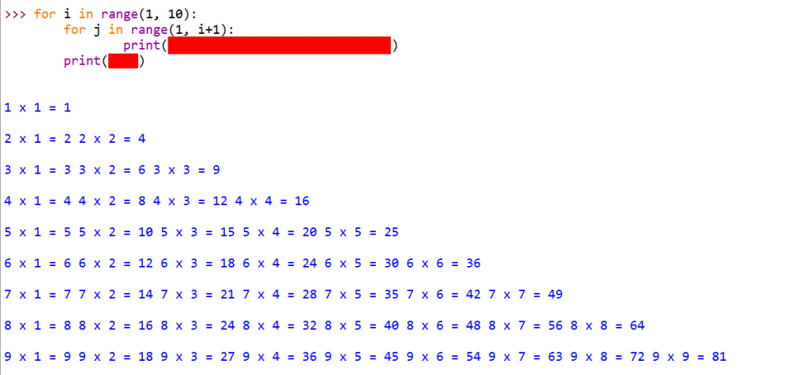

# 004-变量和字符串-下

## 问答题

### 0. 判断代码

- 示例代码

  ```python
  >>> input = "I love FishC.com"
  >>> print(input)
  I love FishC.com
  ```

- 错误的，变量名不能使用Python已有的关键字[^1],比如此处的“变量” - `input`

### 1.  请问下面代码为什么会出错，应该如何解决？

- 示例代码

  ```python
  >>> print("C:\Users\goodb\Desktop")
  SyntaxError: (unicode error) 'unicodeescape' codec can't decode bytes in position 2-3: truncated \UXXXXXXXX escape
  ```

- 转移字符错误，python无法正确将`\`后面的字符识别为python可用的转义字符，所以出现语法错误

- 解决方式：可以使用`r字符串` - 原始字符串或者增加`\`对反斜杠进行转义

  ```python
  #  原始字符串
  print(r'C:\Users\goodb\Desktop')
  # 正确转义\
  print("C:\\Users\\goodb\\Desktop")
  ```

### 2. 如果要为一个函数写说明文档，那么你觉得应该使用哪种字符串比较合适？

- 使用文档字符串 

  ```python
  # 文档字符串
  '''
  单引号文档字符串
  '''
  ------
  
  """
  双引号文档字符串
  """
  ```

### 3. 请问是 '123' 大还是 256 大？

- 这玩意儿看是不知道的，不如用代码看，代码告诉我，**不是同一类型，无法进行比较**

### 4. 请写出下面几个表达式的结果。

- 表达式

  ```python
  A. '123' + 256
  B. '123' + '256'
  C. '123' * 3
  D. '123' - '12'
  ```

- 结果

  ```python
  A. Error  # 不同类型无法相加
  B. '123256'  # 字符串间拼接
  C. `123123123`  
  D. Error   # 字符串间无法进行减法数学运算
  ```

## 动动手

### 0. 请将下面的文本拷贝并赋值给变量名（fishc），使其可以如下图的效果打印输出。

- 文本

  ```python
        ___                     ___          ___          ___     
       /\  \         ___       /\  \        /\__\        /\  \    
      /::\  \       /\  \     /::\  \      /:/  /       /::\  \   
     /:/\:\  \      \:\  \   /:/\ \  \    /:/__/       /:/\:\  \  
    /::\~\:\  \     /::\__\ _\:\~\ \  \  /::\  \ ___  /:/  \:\  \ 
   /:/\:\ \:\__\ __/:/\/__//\ \:\ \ \__\/:/\:\  /\__\/:/__/ \:\__\
   \/__\:\ \/__//\/:/  /   \:\ \:\ \/__/\/__\:\/:/  /\:\  \  \/__/
        \:\__\  \::/__/     \:\ \:\__\       \::/  /  \:\  \      
         \/__/   \:\__\      \:\/:/  /       /:/  /    \:\  \     
                  \/__/       \::/  /       /:/  /      \:\__\    
                               \/__/        \/__/        \/__/
  ```

- fish.py

  ```python
  # -*- coding: utf-8 -*-
  # @Software: PyCharm
  # @Author: Ammoniaw
  # @FileName: fish.py
  # @Date: 2026/8/1
  # @Description: 保持文本格式进行输出 - 使用原始字符串和文档字符串组合的方式
  fishc = r"""
        ___                     ___          ___          ___     
       /\  \         ___       /\  \        /\__\        /\  \    
      /::\  \       /\  \     /::\  \      /:/  /       /::\  \   
     /:/\:\  \      \:\  \   /:/\ \  \    /:/__/       /:/\:\  \  
    /::\~\:\  \     /::\__\ _\:\~\ \  \  /::\  \ ___  /:/  \:\  \ 
   /:/\:\ \:\__\ __/:/\/__//\ \:\ \ \__\/:/\:\  /\__\/:/__/ \:\__\
   \/__\:\ \/__//\/:/  /   \:\ \:\ \/__/\/__\:\/:/  /\:\  \  \/__/
        \:\__\  \::/__/     \:\ \:\__\       \::/  /  \:\  \      
         \/__/   \:\__\      \:\/:/  /       /:/  /    \:\  \     
                  \/__/       \::/  /       /:/  /      \:\__\    
                               \/__/        \/__/        \/__/
  """
  print(fishc)
  ```

### 1. 打印九九乘法表

- 示例代码片段和效果图

- multiplication.py

  ```python
  # -*- coding: utf-8 -*-
  # @Software: PyCharm
  # @Author: Ammoniaw
  # @FileName: multiplication.py
  # @Date: 2026/8/1
  # @Description: 创建99乘法表
  for i in range(1, 10):  # 控制行数
      for j in range(1, i+1):  # 控制列数
          print(f'{i} * {j} = {i*j}', end='\t')  # 使用f-string输出，并使用end控制输出格式
      print('')
  ```

  


[^1]: Python 关键字（也称为保留字）是 Python 语言中具有特殊含义的单词，它们被 Python 解释器保留用于特定的语法功能。这些关键字不能用作变量名、函数名或其他标识符。