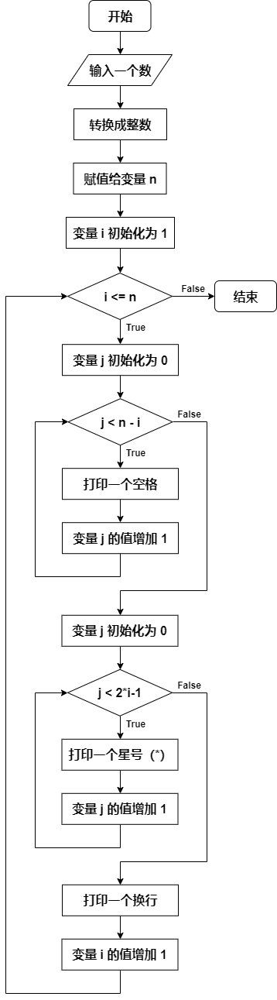
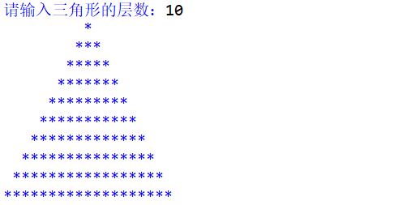
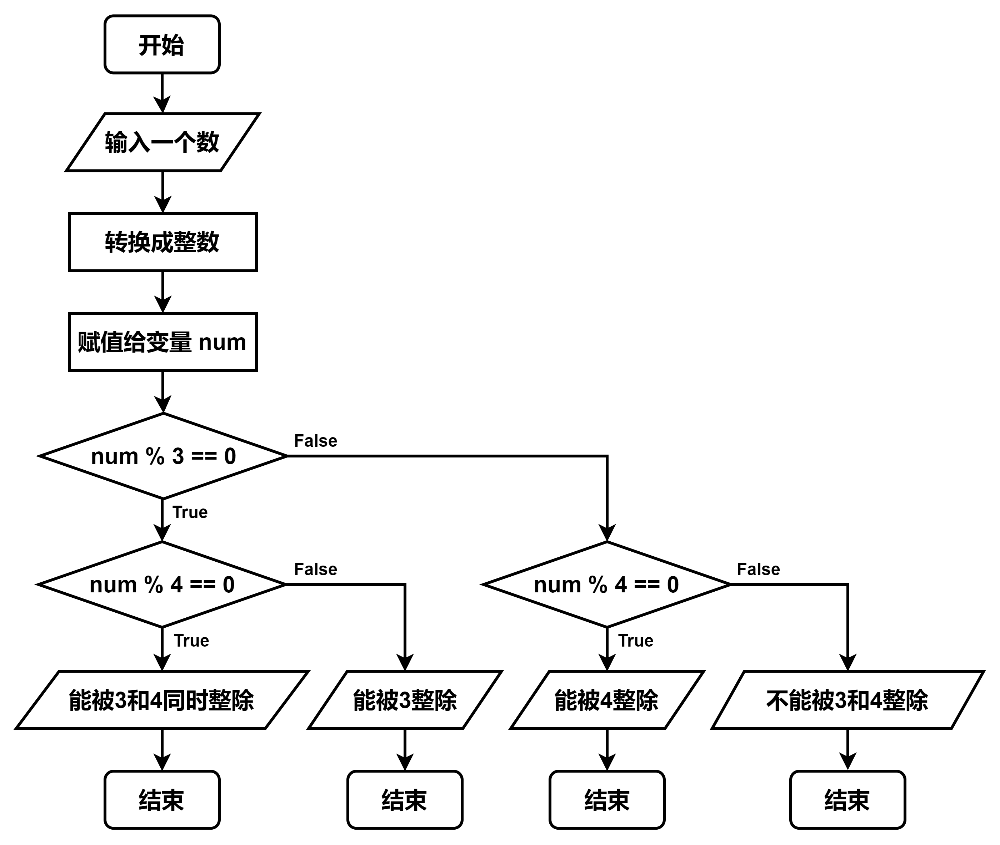

# 012-流程图-flowchart

## 画图题

### 0. 请根据以下代码画出对应的流程图：

- 代码

  ```python
  n = int(input("请输入一个数："))
  print(n)
  ```

- 流程图

  ```mermaid
  flowchart TD
  id1(开始) --> id2[/获取用户输入/] -->id3[转换为整数] -->id4[赋值给变量n] --> id5[/打印输出变量n/] --> id6(结束)
  ```

### 1. 请根据以下代码画出对应的流程图：

- 代码

  ```python
  j = 0
  while j < n-i:
      print(" ", end="")
      j = j + 1
  ```

- 流程图

  ```mermaid
  flowchart TD
  A(开始) --> B[变量j初始化为0] --> C{while循环入口:j < n-i}
  C--True-->D[打印一个空格 不换行] 
  D--> E[j=j+1]
  E--> C
  C --False--> F(结束)
  ```

### 2. 请根据以下代码画出对应的流程图：

- 代码

  ```python
  n = int(input("请输入三角形的层数"))
  i = 1
  while i <= n:
      j = 0
      while j < n-i:
          print(" ", end='')
          j = j + 1
      j = 0
      while j < 2*i - 1:
          print("*", end="")
          j = j + 1
      print("")
      i = i + 1
  ```

- 流程图

  ```mermaid
  flowchart TD
  id1(开始) --> id2[获取用户输入，i=1] --> id3{while i <= n}
  id3 --True--> id4[j=0] --> id5{while j < n-i} --True--> id6[print; j = j + 1] --> id7[j=0] 
  id6 --> id5
  id7 --> id8{while j < 2*i - 1} --True--> id9[print; j = j + 1]
  id9 --> id8
  id9 --> id10[print; i = i + 1]
  id10 --> id3
  ```

- 小甲鱼

  

### 3. 手动运行2中的代码

- 是用来绘制三角形图形的(字符构成)

### 4. 从键盘输入一个整数，判断该数字 “能否被 3 和 4 同时整除 / 能否被 3 整除 / 能否被 4 整除 / 不能被 3 和 4 整除” 4 种情况，并分别打印结果

- 流程图

  ```mermaid
  flowchart TD
  id1[开始] --> id2[获取一个数字] --> id3{能否被 3 和 4 同时整除} --else--> id4{能否被 3 整除 } --else--> id5{ 能否被 4 整除}
  id5 --else--> id6{不能被 3 和 4 整除}
  id3 --True-->id7[结果1]
  id4 --True-->id8[结果2]
  id5 --True-->id9[结果3]
  id6 --True-->id10[结果4]
  id7 --> id11[结束]
  id8 --> id11[结束]
  id9 --> id11[结束]
  id10 --> id11[结束]
  ```

- 小甲鱼

  

- 代码

  ```python
  num = int(input("请输入一个整数："))
  
  if num % 3 == 0:
      if num % 4 == 0:
          print('该数字能被 3 和 4 同时整除。')
      else:
          print('该数字能被 3 整除。')
  elif num % 4 == 0:
      print('该数字能被 4 整除。')
  else:
      print('该数字既不能被 3 整数也不能被 4 整除。')
  ```

  