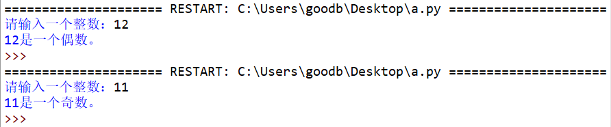
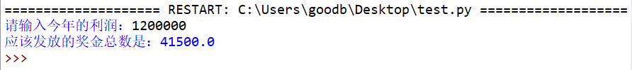

# 014-分支循环01

## 问答题

### 0.  Python 同一个代码块中的所有语句必须遵循什么原则？

- 缩进一致

### 1. 请问下面代码是否能够正常执行？

- 代码

  ```python
  x = 3
  y = 5
  if x > y:
  print("x比y大")
  ```

- ~~正常执行啊~~，不能正常执行，如果想经由if语句来判断是否输出print(),应该将其放在if语句下，而不是同一层级。

### 2.请问下面代码是否能够正常执行？

- 代码

  ```python
  x = 3
  y = 5
  if x < y: print("x比y小")
  ```

- 可以正常执行

### 3.请问下面代码是否能够正常执行？

- 代码

  ```python
  x = 3
  y = 4
  z = 5
  
  if x < y:
    print(x, "<", y)
    if y < z:
              print(y, "<", z)
              print(x, "<", z)
  ```

- 可以正常执行，缩进要保持一致，只不过默认是四个空格。

###  4. 请问下面代码是否能够正常执行？

- 代码

  ```python
  x = 3
  y = 4
  z = 5
  
  if x < y:
    print(x, "<", y)
    if y < z:
              print(y, "<", z)
          print(x, "<", z)
  ```

- 不能正常执行，同一层级的代码缩进应该保持一致

---

## 动动手

### 0.  编写一个程序，让用户输入一个整数，判断其是否奇数还是偶数

- 效果图

- numbers.py

  ```python
  # -*- coding: utf-8 -*-
  # @Software: PyCharm
  # @Author: Ammoniaw
  # @FileName: numbers.py
  # @Date: 2026/8/3
  # @Description: 判断数字
  prompt = "请输入一个数字："
  num = int(input(prompt))
  
  if num % 2 == 0:
      print(f"{num}是一个偶数。")
  else:
      print(f"{num}是一个奇数。")
  ```

### 1.  通常企业发放的年终奖是根据一年的盈利进行提成，A 公司的提成规则如下

- 规则

  ```python
  当利润低于或等于 10 万元时：年终奖为 10%
  
  当利润高于 10 万元，低于 20 万元时：低于 10 万元的部分按 10% 提成，高于 10 万元的部分，按 7.5% 提成
  当利润 20 万到 40 万之间时：低于 10 万元的部分按 10% 提成，高于 10 万元低于 20 万元的部分，按 7.5% 提成，高于 20 万元的部分，按 5% 提成
  
  当利润 40 万到 60 万之间时：低于 10 万元的部分按 10% 提成；高于 10 万元低于 20 万元的部分，按 7.5% 提成；高于 20 万元低于 40 万元的部分，按 5% 提成；高于40万元的部分，按 3% 提成
  
  当利润 60 万到 100 万之间时：低于 10 万元的部分按 10% 提成；高于 10 万元低于 20 万元的部分，按 7.5% 提成；高于 20 万元低于 40 万元的部分，按 5% 提成；高于40万元低于 60 万元的部分，按 3% 提成；高于60万元的部分，按 1.5% 提成
  
  当利润高于 100 万元时：低于 10 万元的部分按 10% 提成；高于 10 万元低于 20 万元的部分，按 7.5% 提成；高于 20 万元低于 40 万元的部分，按 5% 提成；高于40万元低于 60 万元的部分，按 3% 提成；高于60万元低于 100 万的部分，按 1.5% 提成；超过 100 万元的部分按 1% 提成
  ```

  请编写一个程序，根据录入的利润，计算出应该发放的奖金总数？

  程序效果图

  

- bonus.py

  > 感觉这个程序好丑啊 哈哈

  ```python
  # -*- coding: utf-8 -*-
  # @Software: PyCharm
  # @Author: Ammoniaw
  # @FileName: bonus.py
  # @Date: 2026/8/3
  # @Description: 奖金
  prompt = "请输入今年的利润: "
  profit = int(input(prompt))
  bonus = 0
  if profit <= 100_000:
      bonus = profit * 0.1
  elif profit <= 200_000:
      bonus = 100_0000 * 0.1 + (200_0000 - profit) * 0.075
  elif profit <= 400_000:
      bonus = 100_000 * 0.1 + 100_0000 * 0.075 + \
              (400_000 - profit) * 0.05
  elif profit <= 600_000:
      bonus = 100_000 * 0.1 + 100_000 * 0.075 + \
              200_000 * 0.05 + (profit - 600_000) * 0.03
  elif profit <= 1_000_000:
      bonus = 100_000 * 0.1 + 100_000 * 0.075 + \
              200_000 * 0.05 + 200_000 * 0.03 + \
              (profit - 600_000) * 0.015
  elif:
      bonus = 100_000 * 0.1 + 100_000 * 0.075 + \
              200_000 * 0.05 + 200_000 * 0.03 + \
              400_000 * 0.015 + (profit - 1_000_000) * 0.01
  print(f"应该发放的奖金总数是: {bonus}")
  ```

  

