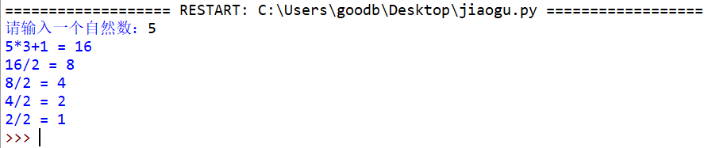

# 015-分支循环02-if语句与嵌套

## 问答题

### 0. Python 是如何区分不同代码块的呢？

- 缩进

### 1. 请问下面代码执行后，x 变量的值是多少？

- 代码

  ```python
  x = 520 if "Love" else 404
  ```

- 结果是 x=520

### 2. 请将下面代码中的条件分支部分修改为使用条件表达式来实现：

- 代码

  ```python
  age = 18
  isMale = True
  if age < 18:
      print("抱歉，未满18岁禁止访问。")
  else:
      if isMale:
          print("任君选购！")
      else:
          print("抱歉，本店商品可能不适合小公举哦~")
  ```

- 条件表达式

  ```python
  print("抱歉，未满18岁禁止访问。") if age < 18 else print("任君选购！") if isMale else print("抱歉，本店商品可能不适合小公举哦~")
  ```

### 3. 其实，大多数 if - else 条件分支还可以使用 and - or 运算符组合的表达式来代替，那么如果将下面代码转变成 and - or 来实现，应该是怎样的呢？

- 代码

  ```python
  if "Love":
      520
  else:
      404
  ```

- 不知道：`"Love" and 520 or 404`, 利用了短路逻辑

### 4. 请将下面的条件分支语句，使用条件表达式实现，并尝试理解这段代码的目的是什么？

- 代码

  ```python
  if a < b:
      if a < c:
          print(a)
      else:
          print(c)
  else:
      if b < c:
          print(b)
      else:
          print(c)
  ```

- 条件表达式 - 目的：找出三个数字中最小的数字

  ```python
  (print(a) if a < c else print(c)) if a < b else (print(b) if b < c else print(c))
  ```

---

## 动动手

### 0. 请编写一个程序，根据录入的血液酒精含量来判断是否酒驾？

- 要求：绘制程序流程图 随后通过代码实现

  ```python
  当酒精含量小于 20 毫克时：不构成饮酒行为
  当酒精含量大于等于 20 毫克且 小于 80 毫克时：已经达到酒后驾驶的标准
  当酒精含量大于等于 80 毫克时：已经达到醉酒驾驶的标准
  ```

- 流程图

  ```mermaid
  flowchart TD
  id1(开始) --> id2[获取输入 - 酒精含量] --> id3{判断1 含量小于20毫克} --True--> id4[不构成饮酒行为]
  id3 --False--> id5{判断2 大于等于 20 毫克且 小于 80 毫克} --True--> id6[已经达到酒后驾驶的标准]
  id5 --False-->id7{判断3 酒精含量大于等于 80 毫克} --True--> id8[已经达到醉酒驾驶的标准]
  id4 --> id9[结束]
  id6 --> id9[结束]
  id8 --> id9[结束]
  ```

- alcohol.py

  ```python
  # -*- coding: utf-8 -*-
  # @Software: PyCharm
  # @Author: Ammoniaw
  # @FileName: alcohol.py
  # @Date: 2026/8/3
  # @Description: 判断是否构成饮酒行为
  prompt = "请输入酒精含量："
  alcohol = int(input(prompt))
  
  if alcohol <= 20:
      print("不构成饮酒行为")
  elif alcohol <= 80:
      print("已经达到酒后驾驶的标准")
  else:
      print("已经达到醉酒驾驶的标准")
  ```

### 1. 验证角谷猜想

- 内容

  ```python
  角谷猜想的内容是：任意给定一个正整数，若它为偶数则除以 2，若它为奇数则乘以 3 再加 1，得到一个新的自然数，按照这样的方法计算下去，最终的结果必将是 1。
  比如给定的自然数是 5，则 5 * 3 + 1 = 16 -> 16 / 2 = 8 -> 8 / 2 = 4 -> 4 / 2 = 2 -> 2 / 2 = 1
  ```

- 实现效果

- 小甲鱼模板

  ```python
  n = int(input("请输入一个正整数："))
  
  while n > 0:
      # 判断 n 是否可以被 2 整除 #
          # 按题目要求打印输出 #
          # 如果能够被 2 整除，应该写什么表达式？#
      else:
          # 按题目要求打印输出 #
          # 如果不能被 2 整除，应该写什么表达式？#
      if n == 1:
          break
  ```

- jiaogu.py

  ```python
  # -*- coding: utf-8 -*-
  # @Software: PyCharm
  # @Author: Ammoniaw
  # @FileName: jiaogu.py
  # @Date: 2026/8/3
  # @Description: 验证角谷猜想
  n = int(input("请输入一个正整数："))
  
  while n > 0:
      if n % 2 == 0:
          print(f"{n}/2 = {int(n / 2)}")
          n = int(n / 2)
      else:
          print(f"{n}*3+1 = {int(n * 3 + 1)}")
          n = int(n * 3 + 1)
      if n == 1:
          break
  ```

- 小甲鱼

  ```python
  n = int(input("请输入一个自然数："))
      
  while n > 0:
      if n % 2 == 0:
          print(n, "/2 = ", n // 2, sep='')  # 小甲鱼使用了整除，很好的避免了 / 产生浮点数
          n = n // 2
      else:
          print(n, "*3+1 = ", n * 3 + 1, sep='')
          n = n * 3 + 1
      if n == 1:
          break
  ```

  

