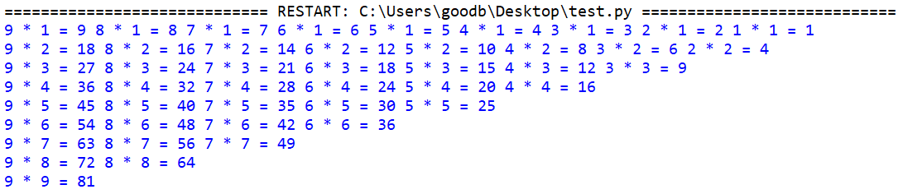
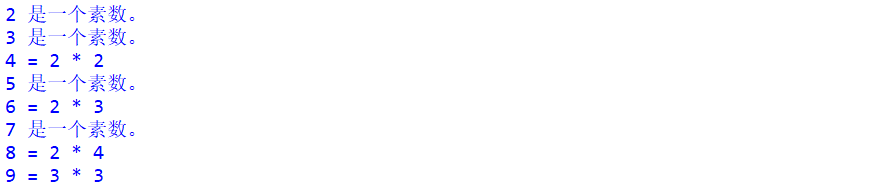

# 017-分支循环04-continue与循环嵌套

## 问答题

### 0. continue 语句和 break 语句都能够跳出循环体，那么它们的区别是什么呢？

- continue跳出本次循环并回到循环入口条件处
- break语句则是直接中止循环，寸止了属于。

### 1. 在不上机的情况下，你能看出下面代码会打印多少次 "FishC" 吗？

- 代码

  ```python
  >>> i = 0
  >>> j = 9
  >>> while i < j:
  ...     i += 1
  ...     j -= 1
  ...     print("FishC")
  ```

- 5次

  |  i   | j    |
  | :--: | :--- |
  |  0   | 9    |
  |  1   | 8    |
  |  2   | 7    |
  |  3   | 6    |
  |  4   | 5    |

### 2. 你觉得 while-else 语法存在的意义是什么？.

- 循环正常结束，才输出else语句中的内容。可以用来检测循环是否正常被得以运行。

### 3. 你能看出下面代码存在什么问题吗？

- 代码

  ```python
  >>> i = 0
  >>> while i < 10:
  ...     if i % 2 == 0:
  ...         continue
  ...     i += 1
  ...     print(i)
  ```

- continue 语句跳过了循环后面的语句，导致变量i的值无法改变，while循环的入口条件始终为真，因此这是一个无限循环！

### 4. 请看下面代码，当 break 语句执行之后，程序是跳转到位置 1 还是位置 2 呢？

- 代码

  ```python
  >>> day = 1
  >>> while day <= 7:
  >>>     while hour <= 8:
  ...         print("今天，我一定要坚持学习8个小时！")
  ...         hour += 1
  ...         if hour > 1:
  ...             break
  ...     # 位置1
  ...     day += 1
  ... # 位置2
  ```

- 位置一，因为break语句以及continue语句都是影响的最近一层的循环。

### 5. 下面代码存在两个问题，细心的你发现了吗？

- 代码

  ```python
  >>> while True:
  ...     command = input("请输入命令（exit/pow）：")
  ...     if command == "pow":
  ...         base = input("请输入底数：")
  ...         exp = input("请输入指数：")
  ...         pow(base, exp)
  ...     elif command == "exit":
  ...         continue
  ```

- input()获取的是字符串，如果需要数值，要使用int()或者float()将字符串类型的数字转换为数字类型。
- 语义错误：不应该说过continue,应该使用break.

---


## 动动手

### 0. 将99乘法表倒过来打印

- 效果

- mulit_table.py

  ```python
  # -*- coding: utf-8 -*-
  # @Software: PyCharm
  # @Author: Ammoniaw
  # @FileName: mulit_table.py
  # @Date: 2026/8/3
  # @Description: 倒着的乘法表
  k = 1
  while True:
      j = 9
      while k <= j:
          print(f"{j} * {k} = {j * k}", end="\t")
          j -= 1
      k += 1
      if k > 9:
          break
      print("")
  ```

### 1.找出 10 以内的所有素数，如果不是素数，请打印出该合数对应的乘积公式，要求代码实现效果如下图：

- 效果

- 代码实现  prime.py

  ```python
  # -*- coding: utf-8 -*-
  # @Software: PyCharm
  # @Author: Ammoniaw
  # @FileName: prime.py
  # @Date: 2026/8/3
  # @Description:10 以内的所有素数
  number = 1
  while number < 10:
      number += 1
      if number == 2 or number == 3:
          print(f"{number}是一个素数。")
          continue
      j = 2
      while number % j == 0:
          print(f"{number} = {j} * {number // j}")
          j += 1
      else:
          print(f"{number}是一个素数。")
  ```

- 小甲鱼

  ```python
  >>> n = 2
  >>> while n < 10:
  ...     x = 2
  ...     while x < n:
      		# 如果数字n能被从2开始到它本身其中一个数字所整除，它就不是素数
  ...         if n % x == 0:
  ...             print(n, "=", x, "*", n // x)
  ...             break
  ...         x += 1
  ...     else:  # 循环正常执行完成 会执行else语句中的代码
  ...         print(n, "是一个素数")
  ...     n += 1
  ```

  

