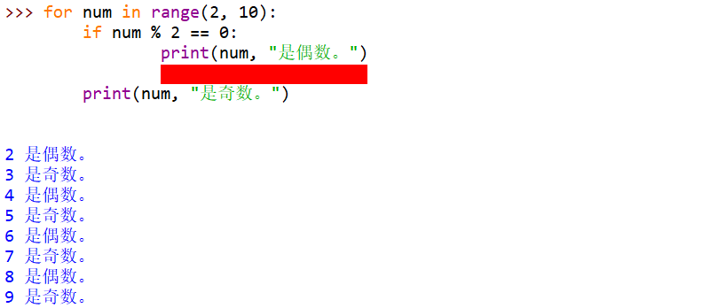
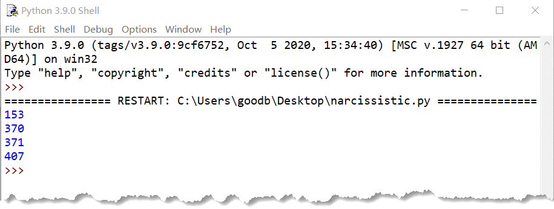

# 018-分支循环05-for循环

## 问答题

### 0. 请问下面代码打印的结果是什么？

- 代码

  ```python
  >>> for i in range(10):
  ...     print(i, end=' ')
  ...     i = 5
  ```

- 结果: ~~1 5 6 7 8 9~~ i值并不会受影响。

  

### 1. 请问下面代码打印的结果是什么？

- 代码

  ```python
  >>> a, b, c = range(3, 10, 3)
  >>> print(a + b + c)
  ```

- 18

### 2. 请问下面代码打印的结果是什么？

- 代码

  ```python
  >>> len(range(0, 10, 2))
  ```

- 5

### 3. 请问下面代码打印的结果是什么？

- 代码

  ```python
  >>> len("FishC") + len(110)
  ```

- 报错 len()函数的参数需要是一个序列或集合。

### 4. 请问下面代码执行后，result 变量的值是多少？

- 代码

  ```python
  >>> result = 0
  >>> for each in range(-10, -100, -20):
  ...     result += each
  ```

- ~~-240~~ -250

### 5.请问下图中，红色涂抹的位置应该填写什么代码，程序才能如期执行？

- 图片

- continue语句

---

## 动动手

### 0. 编写一个程序，求解 100~999 之间的所有水仙花数。

- 科普

  ```python
  如果一个 3 位数等于其各位数字的立方和，则称这个数为水仙花数。例如：153 = 1^3 + 5^3 + 3^3，因此 153 就是一个水仙花数。
  ```

- 效果图

- 代码实现 - numbers.py

  ```python
  # -*- coding: utf-8 -*-
  # @Software: PyCharm
  # @Author: Ammoniaw
  # @FileName: numbers.py
  # @Date: 2026/8/3
  # @Description: 输出1000以内的水仙花数
  
  
  for num in range(2, 1000):
      # 使用 // % 获得数字的个十百位的数字
      g = num % 10
      s = num // 10 % 10
      b = num // 100
      number = pow(g, 3) + pow(s, 3) + pow(b, 3)
      if num == number:
          print(f"{num}")
  
  ```

- 小甲鱼

  ```python
  for i in range(100, 1000):
      sum = 0
      temp = i
      
      while temp:
          sum = sum + (temp % 10) ** 3
          temp //= 10
      
      if sum == i:
          print(i)
  ```

### 1. 判断一个整数是否为回文数。

- 回文数是指正序（从左向右）和倒序（从右向左）读都是一样的整数

- 代码实现

  - 初步想法是 负数不是回文数；0-9是回文数；判断其他情形是否为回文数 - 回文数逆转和之前的数字相等

  - ```python
    组合出一个回文数 回文数逆转之后与之前的数字相等
    number = 12321
    result = 0
    while True:
        if number >= 10:
            g = number % 10
            print(g)
            number //= 10
            result = result * 10 + g
        else:
            print(number)
            break
    result = result * 10 + number
    print(result)
    ```

- 代码实现

  ```python
  # -*- coding: utf-8 -*-
  # @Software: PyCharm
  # @Author: Ammoniaw
  # @FileName: number2.py
  # @Date: 2026/8/3
  # @Description: 回文数
  prompt = "请输入一个整数: "
  number = int(input(prompt))
  
  # 判断该数字是否为回文数
  if number < 0:
      print(f"{number}不是一个回文数")
  elif number < 10:
      print(f"{number}是一个回文数")
  else:
      num = number  # 对原始数字进行保存
      result = 0  # 临时存储逆转之后的数字
      while True:
          if number >= 10:
              g = number % 10
              number //= 10  # 每次让数字损失掉个位
              result = result * 10 + g
          else:
              break
      result = result * 10 + number
      if num == result:
          print(f"{num}是一个回文数")
      else:
          print(f"{num}不是一个回文数")
  ```

- 小甲鱼

  ```python
  x = int(input("请输入一个正整数："))
  
  if x < 0 or (x % 10 == 0 and x != 0):
      print("不是回文数。")
  else:
      revertedNumber = 0
      while x > revertedNumber:
          revertedNumber = revertedNumber * 10 + x % 10
          x //= 10
  
      if x == revertedNumber or x == revertedNumber // 10:
          print("是回文数。")
      else:
          print("不是回文数。")
  ```

  

