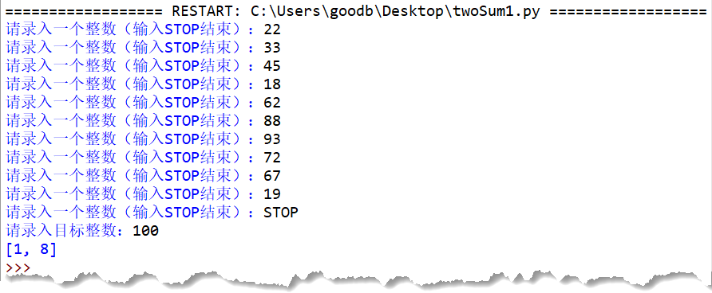

# 2019-列表01-创建与切片

## 问答题

### 0. python 的列表可以容纳各种不同类型的对象，对吗？

- 对的，比如说`mix = [1,2,3,4,5,'my']`,可以存储数字、字符串或者其他数据类型的对象。

### 1. 请问如何创建一个空列表？

- `empty_list = []`

### 2. 你知道什么是匿名列表吗？

- 不是特别清楚，难道是，没有指定变量的列表吗？就是那种创建之后无法再次引用的列表。[还真是啊，这就是匿名列表]

### 3. 如果有一个列表 list1，有两种方法可以获取到该列表的最后一个元素，你知道分别是什么吗？

- way1： `list1[-1]`
- way2：`list[len(list1) - 1]`

### 4. 请问下面代码打印的结果是什么？

- 代码

  ```
  >>> [1, 2, 3, 4, 5][:3]
  ```

- 结果

  ```python
  # 创建切片 取出前三个元素
  [1, 2, 3]
  ```

### 5. 请问下面代码打印的结果是什么？

- 代码

  ```python
  >>> [1, 2, 3, 4, 5][::2]
  ```

- 和使用`range()`相同，切片的第三个参数是步长，即间隔多少个元素再进行提取。

- 结果

  ```python
  # 从列表开头开始 间隔2个元素进行提取
  [1,3,5]
  ```

### 6. 请问下面代码打印的结果是什么？

- 代码

  ```python
  >>> [5, "上", 4, "山", 3, "打", 2, "老", 1, "虎"][-2::-2]
  ```

- 结果

  ```python
  # 逆序且开始元素为1
  [1,2,3,4,5]
  ```

### 7. 下面有两列表，请问如何将 list2 列表中的全部元素，添加到 list1 列表中第 2 和第 3 个元素的中间。

- 代码

  ```python
  >>> list1 = [1, 2, 8, 9]
  >>> list2 = [3, 4, 5, 6, 7]
  ```

- 实现

  ```python
  # 插入到第2.3个元素中间，指定索引为2
  list3 = list[-2:]
  list1[2] = list2
  list1[-2:] = list3
  # 以上做法错了，应该使用+进行拼接
  list1 = list1[:2] + list2 + list1[2:]
  ```

---

## 动动手

### 0. 给定一个整数列表 nums 和一个目标值 target，请在该数组中找出和为目标值的两个元素，并将它们的数组下标值打印出来。

- 比如给定的列表 nums = [2, 7, 11, 15]，目标值 target = 9，那么由于 nums[0] + nums[1] = 2 + 7 = 9，所以打印结果是：[0, 1]

- 代码实现 - target_index.py 

  ```python
  # -*- coding: utf-8 -*-
  # @Software: PyCharm
  # @Author: Ammoniaw
  # @FileName: target_index.py
  # @Date: 2026/8/4
  # @Description: 输出达成目标的列表索引
  list1 = [2, 7, 11, 15]
  target = 9
  for i in range(len(list1) - 1):  # 从头开始查找
      for j in range(i, len(list1) - 1): # 跳过list[i]本身
          if list1[i] + list1[j + 1] == target:  # 计算判断list[i] 与其后面的每个元素之和是否为target
              print([i, j + 1])
  ```

### 1. 这次我们想让用户自己来录入 nums 和 target 的数据，请修改上一题的代码，让程序实现如下：

- 效果图

  

- 代码实现

  ```python
  # -*- coding: utf-8 -*-
  # @Software: PyCharm
  # @Author: Ammoniaw
  # @FileName: input_target.py
  # @Date: 2026/8/4
  # @Description: 输入列表与目标 获取索引
  
  
  list_prompt = "请输入一个整数（输入STOP结束）："
  target_prompt = "请输入目标整数："
  list1 = []
  while True:
      # 请求用户输入列表
      element = input(list_prompt)
  
      if element == 'STOP':
          break
      else:
          list1.append(int(element))
  target = int(input(target_prompt))
  # target = 100
  # list1 = [22, 33, 45, 18, 62, 88, 93, 72, 67, 19]
  # 给出结果
  found = False
  for i in range(len(list1) - 1):
      for j in range(i, len(list1) - 1):
          # 将元素进行组合判断是否与目标相等
          if list1[i] + list1[j + 1] == target:
              print([i, j + 1])
              # 更新状态 此处说明找到了目标元素
              found = True
              
  if not found:
      print("没找到")
  
  ```
  
  