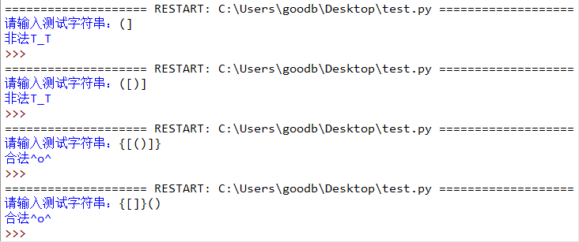

# 020-列表02-列表元素的增加与删除

## 问答题

### 0. 列表的 extend() 方法是否支持使用字符串来扩展列表？

- extend()方法的参数，是一个可迭代对象，而字符串同样是可迭代对象，因此可以，就是不知道是什么效果，还没有尝试过。

- 实现效果

  ```python
  >>> s = [1,2,3,4,5]
  >>> str1= 'FishC'
  >>> s.extend(str1)
  >>> s
  [1, 2, 3, 4, 5, 'F', 'i', 's', 'h', 'C']
  ```

### 1. 请问下面代码是否会报错？

- 代码

  ```python
  >>> s = [1, 2, 3]
  >>> s.append([4, 5, 6])
  ```

- 不会，但是实现的效果为，将这个列表作为s列表的最后一位元素。

### 2. 请将下面代码改为使用列表的 insert() 方法实现。

- 代码

  ```python
  >>> s = [1, 2, 3, 4, 5]
  >>> s.append(6)
  ```

- 实现

  ```python
  s.insert(len(s), 6)
  ```

### 3. 请问下面代码执行后，列表 s 的内容是什么？

- 代码

  ```python
  >>> s = [1, 2, 3, 4, 5]
  >>> s.extend(["FishC"])
  ```

- extend()方法是将可迭代对象添加到指定列表中，因此

  ```python
  [1, 2, 3, 4, 5, 'FishC']
  ```

### 4. 请使用切片的语法，实现与下面代码相同的效果。

- 代码

  ```python
  >>> s = [1, 2, 3, 4, 5]
  >>> s.append("上山打老虎")
  >>> s
  [1, 2, 3, 4, 5, '上山打老虎']
  ```

- 实现

  ```python
  s = [1, 2, 3, 4, 5]
  s[len(s):] = ['上山打老虎']
  ```

### 5. 请使用切片的语法，实现与下面代码相同的效果

- 代码

  ```python
  >>> s = [1, 2, 3, 4, 5]
  >>> s.extend("上山打老虎")
  >>> s
  [1, 2, 3, 4, 5, '上', '山', '打', '老', '虎']
  ```

- 实现

  ```python
  s = [1, 2, 3, 4, 5]
  # 不能够这样写s[len(s):] = ['上', '山', '打', '老', '虎']
  s[len(s):] = '上山打老虎'
  ```

### 6. 请问下面代码执行后，列表 s 的内容是什么？

- 代码

  ```python
  >>> s = [1, 2, 3, 4, 5]
  >>> s[len(s)-2:] = [2, 1]
  ```

- ~~类似于extend的话，我觉得应该是不会替换剩下的两个元素 - s = [1,2,3,2,1,4,5]~~

- 执行的流程为

  ```python
  # 清除s列表的第三个元素以后的内容，
  s[len(s)-2:] 
  # 随后进行元素添加
  s = [1,2,3,2,1]
  ```

  

---

## 动动手

### 0 . 请编写一个程序，判断给定的字符串 s 中括号的写法是否合法

- 条件

  ```python
  字符串仅包含 '('、')'、'['、']'、'{'、'}' 这三对括号的组合
  左右括号必须成对编写，比如 "()" 是合法的，"(" 则是非法的
  左右括号必须以正确的顺序闭合，比如 "{()}" 是合法的，"{(})" 则是非法的
  ```

- 实现效果

  

- 代码实现 小甲鱼 - brackets‌.py

  > 这个则是完全看不懂了，不仅小甲鱼的思路还是代码都完全看不懂，想把头砍下来了
  >
  > 看了讲解，确实是可以理解，但是如果自己完全不看思路的话，很难写出来(还是没懂啊)

  ```python
  s = input("请输入测试字符串：")
  
  # 创建一个特殊列表
  stack = []
      
  for c in s:
      # 如果是左括号，那么添加到特殊列表中
      if c == '(' or c == '[' or c == '{':
          stack.append(c)
      # 如果是右括号的情况
      else:
          # 如果碰到右括号，但特殊列表中没有左括号，那么肯定是非法的
          if len(stack) == 0:
              print("非法T_T")
              break
      
          # 逐个给出 c 对应的右括号 d 用于与特殊列表stack最后一个元素进行匹配
          if c == ')':
              d = '('
          elif c == ']':
              d = '['
          elif c == '}':
              d = '{'
      
          # 对比 d 和从特殊列表尾部弹出的元素
          if d != stack.pop():
              print("非法T_T")
              break
  else:
      # 如果循环走完，特殊列表不为空，那么肯定是左括号比右括号多的情况
      # 那肯定有同学会问：右括号比左括号多的情况在哪里判断？ -如果出现这种情况，在开始的时候就排除了
      # 小甲鱼答：在上面 d != stack.pop() 的判断中已经可以排除了~  
      if len(stack) == 0:
          print("合法^o^")
      else:
          print("非法T_T")
  ```

  

