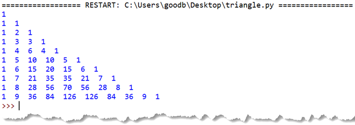
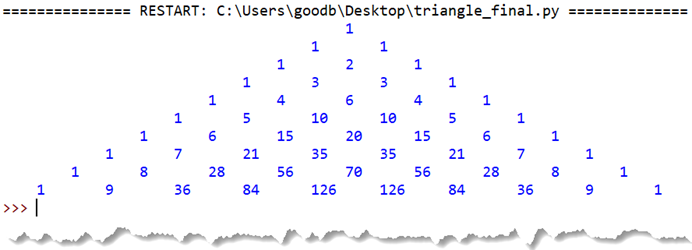

# 024-列表06-列表推导式

## 问答题

### 0.  请使用列表推导式，创建一个内容为 [1, 4, 9, 16, 25, 36] 的列表？

- 代码

  ```python
  square_list = [i ** 2 for i in range(1,7)]
  ```

### 1. 请使用列表推导式，创建一个内容为 [[0, 2], [1, 3], [2, 4], [3, 5], [4, 6], [5, 7]] 的列表？

- 代码

  ```python
  list1 = [[i,i+2] for i in range(0,6)]
  ```

### 2. 请将下面的列表推导式转换为循环的形式实现

- 代码

  ```python
  >>> double = [c * 2 for c in "FishC"]
  >>> double
  ['FF', 'ii', 'ss', 'hh', 'CC']
  ```

- 循环形式

  ```python
  double = []
  for c in "FishC":
      double.append(c*2)
  ```

### 3.请将下面的循环转换为列表推导式的形式实现？

- 代码

  ```python
  >>> matrix = [[1, 2, 3],
  ...           [4, 5, 6],
  ...           [7, 8, 9]]
  >>> diag = []
  >>> for i in range(len(matrix)):
  ...     i *= matrix[i][i]
  ...     diag.append(i)
  ...
  >>> diag
  [0, 5, 18]
  ```

- 列表推导式

  ```python
  diag = [martrix[i][i] * i for i in range(len(matrix))]
  ```

###  4. 请问下面代码执行后，变量 x 和 y 的值分别是什么？

- 代码

  ```python
  >>> x = "FishC"
  >>> y = [x for x in "123"]
  ```

- 执行结果

  ```python
  x = "FishC"
  y = ['1','2','3']
  """
  在 Python 3 中，列表推导式拥有自己的独立作用域（就像函数一样）。
  推导式内部的迭代变量 x 是一个全新的局部变量，不会影响外面那个也叫 x 的变量 - 全局变量。
  所以外面定义的 x = "FishC" 安然无恙。
  """
  ```

### 5. 解决一下课堂中遗留的问题吧，如何获取矩阵从右上角到左下角这条对角线上的元素？

- 矩阵

  ```python
  >>> matrix = [[1, 2, 3],
  ...           [4, 5, 6],
  ...           [7, 8, 9]]
  ```

- 代码实现

  ```python
  list1 = [matrix[i][len(matrix) - i - 1]for i in range(len(matrix))]
  ```

  

---

## 动动手

### 0. 打印杨辉三角形

- 说明

  ```python
  杨辉三角形是中国古代数学的杰出研究成果之一，是我国北宋数学家贾宪于 1050 年首先发现并使用的。而后南宋数学家杨辉在《详解九章算法》一书中记载并保存了“贾宪三角形“。因此，贾宪三角形又被称为杨辉三角形。
  ```

- 编写代码 实现如下

-  代码实现

  > 没有一点头绪，我还是看看小甲鱼的代码结构吧　只做到填充了一部分，剩下的还是没头绪 

  ```python
  # 初始化杨辉三角形
  # 创建一个10*10的二维列表，并将所有的元素初始化为0
  triangle = []
  for i in range(10):
      triangle.append([])  ## 添加空列表作为一维列表的子元素
      for j in range(10):
          triangle[i].append(0)  ## 随后在空列表中添加0作为其子元素
      
  # 计算杨辉三角形
  # 根据观察，我们知道杨辉三角形左右两边的元素均为1
  for i in range(10):
      triangle[i][0] = 1
      triangle[i][i] = 1  
      
  # 第i行j列的值 = 第(i-1)行(j-1)列的值 + 第(i-1)行(j)列的值
  for i in range(2, 10):
      for j in range(1, i):
          triangle[i][j] = triangle[i-1][j-1] + triangle[i-1][j]
      
  # 输出杨辉三角形
  for i in range(10):
      for j in range(i+1):
          print(triangle[i][j], end='  ')
      print()
  ```

### 1.在不使用超纲姿势的前提下，修改代码，将杨辉三角形按下图的形式打印：

- 效果

  

  

- 代码实现 - 小甲鱼

  ```python
  # 初始化杨辉三角形
  # 创建一个10*10的二维列表，并将所有的元素初始化为0
  triangle = []
  for i in range(10):
      triangle.append([])
      for j in range(10):
          triangle[i].append(0)
      
  # 计算杨辉三角形
  # 根据观察，我们知道杨辉三角形左右两边的元素均为1
  for i in range(10):
      triangle[i][0] = 1
      triangle[i][i] = 1
      
  # 第i行j列的值 = 第(i-1)行(j-1)列的值 + 第(i-1)行(j)列的值
  for i in range(2, 10):
      for j in range(1, i):
          triangle[i][j] = triangle[i-1][j-1] + triangle[i-1][j]
      
  # 输出杨辉三角形
  for i in range(10):
      # 因为是三角形，所以i越小，前边需要填充的TAB越多
      for k in range((10-i)//2):
          print('\t', end='')
      for j in range(i+1):
          # 要形成“隔行错开”的效果，所以我们在偶数行加4个空格
          if i % 2 == 1:
              print("    ", end='')
          # 为何要使用TAB而非空格，大家可以将下面的end='\t'改成对应的空格数即可知晓
          print(triangle[i][j], end='\t')
      print()
  ```

  

​	