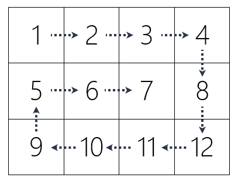

# 025-列表07-列表推导式扩展

## 问答题

### 0. 有时候我们会看到大牛的代码中使用单独一个下划线（_）来作为变量的名字，它通常有何含义？

- 充当临时变量，没有那么重要(大概)，但和变量有同样的作用

### 1. 请将下面列表推导式还原成循环语句的实现形式。

- 代码

  ```python
  result = [i / 2 for i in range(10) if i % 2 == 0]
  ```

- 循环形式

  ```python
  result = []
  for i in range(10):
      if i % 2 == 0:
          result.append(i/2)
  ```

### 2. 请使用列表推导式创建一个 4 * 5 的二维列表，并将每个元素初始化为数字 8。

- 代码实现

  > 小甲鱼使用了列表的乘法

  ```python
  s = [[8] * 5 for i in range(4)]
  ```

- 展开为循环格式

  ```python
  nums = []
  for i in range(4):
      num = []
      for j in range(5):
          num.append(8)
      nums.append(num)
  ```

### 3.请将下面的嵌套循环语句使用列表推导式实现。

- 代码

  ```python
  >>> result = []
  >>> for x in range(10):
  ...     if x % 2 == 0:
  ...         for y in range(10):
  ...             if y % 2 != 0:
  ...                 result.append([x, y])
  ```

- 列表推导式

  ```python
  result = [[x,y] for x in range(10) if x % 2 == 0 for y in range(10) if y % 2 != 0]
  ```

### 4. 请将下面 matrix 矩阵反向展开，即使得最终的结果为 [9, 8, 7, 6, 5, 4, 3, 2, 1]。

- 代码

  ```python
  matrix = [[1, 2, 3],
            [4, 5, 6],
            [7, 8, 9]]
  ```

- 循环语句

  ```python
  reverse_list = []
  for i in range(3):
      for j in range(3):
          reverse_list.append(matrix[3-i-1][3-j-1])
  ```

- 列表推导式

  ```python
  reverse_list = [matrix[3-i-1][3-j-1] for i in range(3) for j in range(3)]
  ```

- 小甲鱼 - 列表推导式

  ```python
  flatten = [col for row in matrix for col in row][::-1]
  # 这个确实巧妙 先将二维列表降维为1维列表，随后使用切片进行逆序，直接就得出了答案
  ```

  

### 5. 鱼C-T恤总共提供了有 2 种颜色（"BLACK", "WHITE"）和 10 个码数（"WS", "WM", "WL", "S", "M", "L", "XL", "2XL", "3XL", "4XL"）的选择，请使用列表推导式统计所有颜色和尺码的组合（要求将每个组合使用一个内嵌的列表包含起来，如下所示）

- 代码

  ```python
  >>> colors = ["BLACK", "WHITE"]
  >>> sizes = ["WS", "WM", "WL", "S", "M", "L", "XL", "2XL", "3XL", "4XL"]
  >>> 
  >>> # 请使用列表推导式，统计得出下面的结果
  >>> 
  >>> result
  [['BLACK', 'WS'], ['BLACK', 'WM'], ['BLACK', 'WL'], ['BLACK', 'S'], ['BLACK', 'M'], ['BLACK', 'L'], ['BLACK', 'XL'], ['BLACK', '2XL'], ['BLACK', '3XL'], ['BLACK', '4XL'], ['WHITE', 'WS'], ['WHITE', 'WM'], ['WHITE', 'WL'], ['WHITE', 'S'], ['WHITE', 'M'], ['WHITE', 'L'], ['WHITE', 'XL'], ['WHITE', '2XL'], ['WHITE', '3XL'], ['WHITE', '4XL']]
  ```

- 列表推导式

  > 直接使用列表推导式我搞不出来，我还是先用循环语句写一遍 

  ```python
  colors = ["BLACK", "WHITE"]
  sizes = ["WS", "WM", "WL", "S", "M", "L", "XL", "2XL", "3XL", "4XL"]
  colors_sizes = []
  for color in colors:
      for size in sizes:
          colors_sizes.append([color, size])
  ```

  根据循环语句写出列表推导式

  > 哦豁 对喽就这么使用，这就是正确的

  ```python
  colors_sizes = [[color, size] for color in colors for siez in sizes]
  ```

---

## 动动手

### 0. 请使用列表推导式，获得 matrix 矩阵的转置矩阵 Tmatrix（将 matrix 的行列互换之后得到的矩阵，称为 matrix 的转置矩阵）

- 说明

  ```python
  一个矩阵 matrix，把它的第一行变成第一列，第二行变成第二列，……，最末一行变为最末一列，从而得到一个新的矩阵 Tmatrix。这一过程称为矩阵的转置。
  ```

- 代码

  ```python
  >>> matrix = [[1, 2, 3, 4],
  ...           [5, 6, 7, 8],
  ...           [9, 10, 11, 12]]
  ```

- 代码实现

  > 这块参考了官方文档的[嵌套的列表推导式](https://docs.python.org/zh-cn/3.14/tutorial/datastructures.html#nested-list-comprehensions)

  ```python
  # 尝试使用循环语句实现
  tmatrix = []
  for i in range(4):
       list1 = []
       for j in range(3):
          list1.append(matrix[j][i])
       tmatrix.append(list1)
      
  # 使用列表推导式实现
  tmatrix = [[[matrix[j][i] for j in range(3)]for i in range(4)]
  ```

### 1.请按照顺时针螺旋顺序输出矩阵中的所有元素。

- 代码

  ```python
  >>> matrix = [[1, 2, 3, 4],
  ...           [5, 6, 7, 8],
  ...           [9, 10, 11, 12]]
  ```

- 要求输出：

  ```python
  [1, 2, 3, 4, 8, 12, 11, 10, 9, 5, 6, 7]
  ```

- 图示

  

- 代码实现

  > 对不起，一点想法也没有

  ```python
  matrix = [[1, 2, 3, 4],
            [5, 6, 7, 8],
            [9, 10, 11, 12]]
      
  rows = len(matrix)
  cols = len(matrix[0])
      
  left = 0
  right = cols - 1
  top = 0
  bottom = rows - 1
      
  result = []
      
  while left <= right and top <= bottom:
      # 从左往右遍历
      for col in range(left, right + 1):
          result.append(matrix[top][col])
      
      # 从上往下遍历
      for row in range(top + 1, bottom + 1):
          result.append(matrix[row][right])
      
      if left < right and top < bottom:
          # 从右往左遍历
          for col in range(right - 1, left, -1):
              result.append(matrix[bottom][col])
      
          # 从下往上遍历
          for row in range(bottom, top, -1):
              result.append(matrix[row][left])
      
      left = left + 1
      right = right - 1
      top = top + 1
      bottom = bottom - 1
      
  print(result)
  ```

  