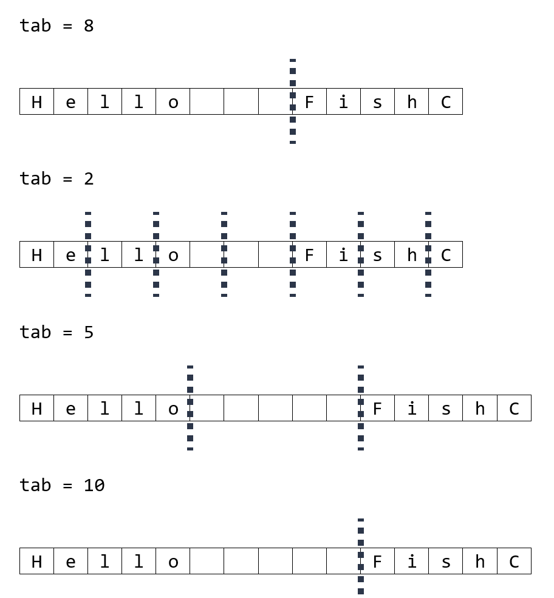
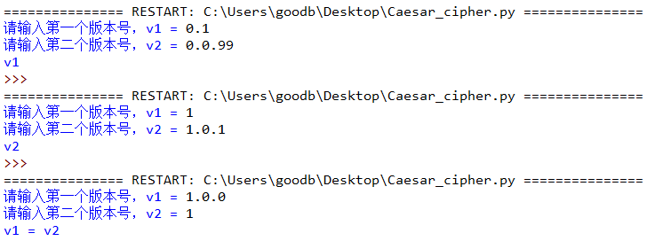
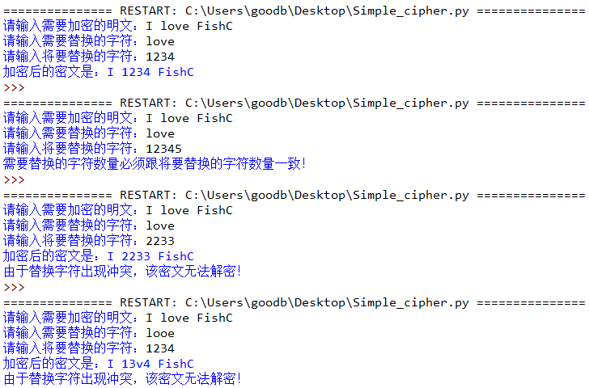

# 028-字符串02-元素索引查找与替换

## 问答题

### 0. 请问下面代码打印的结果是什么？

- 代码

  ```python
  >>> str1 = "xxxxx"
  >>> str1.count("xx")
  ```

- ~~结果: 4~~
- 结果：2，因为`count()`方法返回在目标字符串中不重叠出现的次数，一个目标元素不能重复匹配

### 1. 字符串的 find() 方法和 index() 方法同样是返回查找对象的下标值，那么它们之间的区别是？

- 如果所查找的对象不存在的话，find()方法返回-1，而index()方法则会报错。

### 2. 请问下面代码返回的值是什么？

- 代码

  ```python
  >>> x = "上海自来水来自海上"
  >>> x.rindex("来水来")
  ```

- ~~返回值：5，从右向左查找。~~
- 返回值：确实是从右向左进行查找，从左往右进行匹配

### 3. 请问下面代码执行的结果是 A 还是 B 抑或是 C 呢（为了你可以更容易地计数，下面使用 * 表示空格）

- 代码

  ```python
  print(x)
  print(x.expandtabs(2))
  print(x.expandtabs(5))
  print(x.expandtabs(10))
  ```

- ```python
  # A
  Hello****FishC
  Hello**ishC
  Hello*****FishC
  Hello**********FishC
  
  #B
  Hello***FishC
  Hello*FishC
  Hello*****FishC
  Hello*****FishC
  
  
  #C
  Hello***FishC
  Hello*FishC
  Hello*****FishC
  Hello**********FishC
  ```

- ~~A~~

- B

- 图示说明

  

  

### 4. 请问下面代码打印的结果是什么？

- 代码

  ```python
  >>> "I love FishC.com".translate(str.maketrans("ABCDEFG", "12345678"))
  ```

- 结果：

  > maketrans的参数多了一位，这就不知道转换规则是不是还起作用

  ```python
  
  ```

### 5. 请问下面代码打印的结果是什么？

- 代码

  ```python
  >>> "I love FishC.com".translate(str.maketrans("love", "1234", "love"))
  ```

- 结果：

  > 不知道，肯定不是删除又替换的，应该有一个执行顺序。

  ```python
  # 报错,str.maketrans() 方法要求两个构成映射关系的参数必须是等长的。 
  ```

---

## 动动手

### 0.用户输入两个版本号 v1 和 v2，请编写代码比较它们，找出较新的版本。

- 说明

  ```python
  """
  版本号是由一个或多个修订号组成，各个修订号之间由点号（.）连接，每个修订号由多位数字组成，例如 1.2.33 和 0.0.11 都是有效的版本号。
  
  从左到右的顺序依次比较它们的修订号，点号（.）左侧的值要比右侧的权重大，即 0.1 要比 0.0.99 大。科普：
  
  版本号是由一个或多个修订号组成，各个修订号之间由点号（.）连接，每个修订号由多位数字组成，例如 1.2.33 和 0.0.11 都是有效的版本号。
  
  从左到右的顺序依次比较它们的修订号，点号（.）左侧的值要比右侧的权重大，即 0.1 要比 0.0.99 大。
  """
  ```

- 实现效果

  

- 代码实现

  > 依旧没有一点想法

  ```python
  v1 = input("请输入第一个版本号，v1 = ")
  v2 = input("请输入第二个版本号，v2 = ")
      
  n, m = len(v1), len(v2)
  i, j = 0, 0
      
  while i < n or j < m:
      x = 0
      while i < n and v1[i] != '.':
          x = x * 10 + int(v1[i])
          i += 1
      i += 1
      y = 0
      while j < m and v2[j] != '.':
          y = y * 10 + int(v2[j])
          j += 1
      j += 1
      if x > y:
          print("v1")
          break
      elif x < y:
          print("v2")
          break
      
  if x == y:
      print("v1 = v2")
  ```

### 1. 编写一个加密程序，其实现原理是通过替换指定的字符进行加密，附加要求是实现密文逆向检测。

- 实现效果

  

- 代码实现

  > :bulb:正向检测使用translate()方法，逆向检测应该是与原字符串进行对比是吧；如果匹配的数量不一致，是会抛出异常的，现在还没有学习到try-except处理异常，那应该如何操作呢？...还是看看小甲鱼是怎么做的吧

  ```python
  plain = input("请输入需要加密的明文：")
  x = input("请输入需要替换的字符：")
  y = input("请输入将要替换的字符：")
      
  # 加密的代码
  if len(x) != len(y):
      print("需要替换的字符数量必须跟将要替换的字符数量一致！")
  else:
      cipher = plain.translate(str.maketrans(x, y))
      print("加密后的密文是：" + cipher)
      
  # 检测冲突的代码
  # flag 变量标志是否退出检测（只要找到一个冲突，就可以直接退出）
  flag = 0
      
  # 如果 x 中存在相同的字符，那么 y 对应下标的字符也应该是相同的
  for each in x:
      if x.count(each) > 1 and flag == 0:
          i = x.find(each)
          last = y[i]
          while i != -1:
              if last != y[i]:
                  print("由于替换字符出现冲突，该密文无法解密！")
                  flag = -1
                  break
      
              i = x.find(each, i+1)
      
  # 如果 y 中存在相同的字符，那么 x 对应下标的字符也应该是相同的
  for each in y:
      if y.count(each) > 1 and flag == 0:
          i = y.find(each)
          last = x[i]
          while i != -1:
              if last != x[i]:
                  print("由于替换字符出现冲突，该密文无法解密！")
                  flag = -1
                  break
      
              i = y.find(each, i+1)
  ```

  