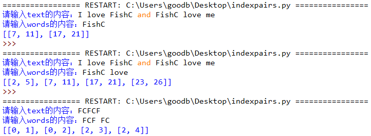
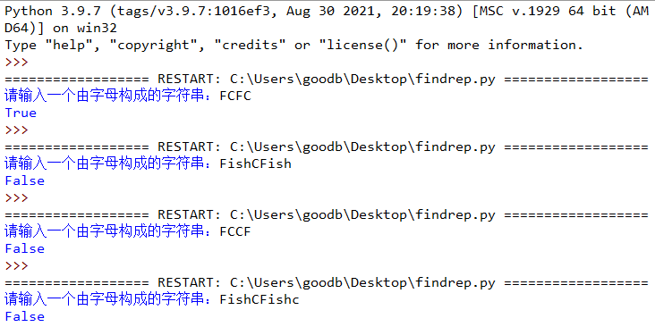

# 029-字符串03-判断

> 了解字符串中多种判断方法 返回值为布尔值 - True/False

## 问答题

### 0. 请问下面代码执行的结果是？

- 代码

  ```python
  >>> x = "我爱Pyhon"
  >>> x.startswith(["你", "我", "她"])
  ```

- `startswith()`支持以元组形式传入待匹配的字符串，但是示例代码使用了列表进行参数传递，这就不知道是什么执行效果了。--->报错

  

### 1. 请问下面代码执行的结果是？

- 代码

  ```python
  >>> "I love FishC\s".isprintable()
  ```

- `isprintable()`是用于判断字符串所有的字符是否都是可打印字符的，所以重点在`\s`是否是一个转义字符，但是我查了查，好像没有这个转义字符，因此返回`True`

### 2. `isdecimal()`、`isdigit()` 和 `isnumeric()` 这 3 个方法都是判断数字的，那么请问这其中哪一个方法 “最严格”，哪一个又是 “最宽松” 的呢？

- 感觉从字面意思就能判断了，`isdecimal()`一看就是只能判断是不是10进制的，而`isdigit()`用于判断是不是常见数字的，而`isnumeric()`就最为宽松了，罗马数字和中文的一 二 三 都能成功识别。
- `isdecimal()` 方法是最严格的，只有真正意义上的数字才能得到 True；`isnumeric()` 方法是最宽松的，罗马数字、中文数字。

### 3. 请问下面代码执行的结果是？

- 代码

  ```python
  >>> "一二三四五上山打老虎".isalnum()
  ```

- ~~`isalnum()`的作用 - 如果字符串中至少有一个字符并且所有字符都是字母或数字则返回 True，否则返回 False，因此返回`False`~~

- `isalnum()` 方法则是集大成者，只要 `isalpha()`、i`sdecimal()`、`isdigit()` 或者 `isnumeric()` 任意一个方法返回 True，结果都为 True。

#### 4. 请使用一行代码判断 s 字符串中，是否所有字符都是英文字母？

- 代码

  > `isalpha()`：如果字符串中至少有一个字符并且所有字符都是字母则返回 True，否则返回 False
  > 但是这里的字母指的是Unicode编码中定义的字母，不只是26个英文字母，所以不知道该怎么做 - 看看小甲鱼吧

  ```python
  x.isalpha() and x.isascii()
  ```

- 解析：由于 isalpha() 方法判断的字母是 Unicode 编码中定义的字母，所以像 "FishC小甲鱼" 这样的字符串它也会返回 True，显然不符合题意。

### 5.  请问下面代码执行的结果是？

- 代码

  ```python
  >>> "一二三木头人".isidentifier()
  ```

- True - 因为中文现在可以作为变量名使用了，但是不推荐。(不知道从哪个版本开始的)

---

## 动动手

### 0. 给定一个字符串 text 和字符串列表 words，返回 words 中每个单词在 text 中的位置（要求最终的位置从小到大进行排序）。

- 示例

  ```python
  举例：
  
  text："I love FishC and FishC love me"
  words："FishC"
  输出：[[7, 11], [17, 21]]
  
  text："I love FishC and FishC love me"
  words："FishC love"
  输出：[[2, 5], [7, 11], [17, 21], [23, 26]]
  
  text："FCFCF"
  words："FCF FC"
  输出：[[0, 1], [0, 2], [2, 3], [2, 4]]
  ```

- 实现效果

  

- 代码实现

  > 说实话，一脸懵逼，感觉得放个爱因斯坦在我的脑子里面了
  > 小甲鱼提示 - 分割字符串可以使用 split() 实现，按空格进行分割即 words = words.split()。

  ```python
  text = input("请输入text的内容：")
  words = input("请输入words的内容：")
  words = words.split()
      
  result = []
  for each in words:
      temp = text.find(each)
      while temp != -1:
          result.append([temp,temp+len(each)-1])
          temp = text.find(each, temp+1)
      
  print(sorted(result))
  ```

### 1. 编写一个程序，判断输入的字符串是否由多个子字符串重复多次构成。

- 示例

  ```python
  输入："FCFC"
  输出：True
  
  输入："FishCFish"
  输出：False
  
  输入："FCCF"
  输出：FalseP
  
  输入："FishCFishc"
  输出：False
  ```

- 实现效果
  

  ```python
  
  ```

- 代码实现

  > 小甲鱼的提示
  > 如果一个长度为 n 的字符串 s 可以由它的一个长度为 i 的子串 t 重复多次构成，那么必须要满足以下条件：
  >
  > - n 一定是 i 的倍数
  > - t 一定是 s 的前缀子字符串
  > - n 除以 i 的结果必定是 t 在 s 中出现的次数

  ```python
  s = input("请输入一个由字母构成的字符串：")
      
  n = len(s)
  for i in range(1, n//2+1):
      # 如果子字符串的长度为i，则n必须可以被i整除才行
      if n % i == 0:
          # 如果子字符串的长度为i，则i到i*2之间是一个重复的子字符串
          if s.startswith(s[i:i*2]) and s.count(s[i:i*2]) == n/i:
              print(True)
              break
  # for...else的用法，小甲鱼希望大家还没有忘记哦^o^
  else:
      print(False)
  ```
  
  