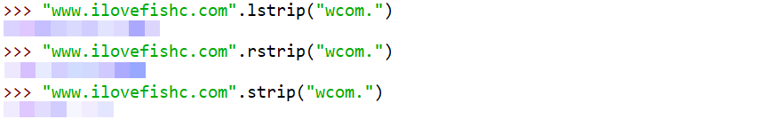
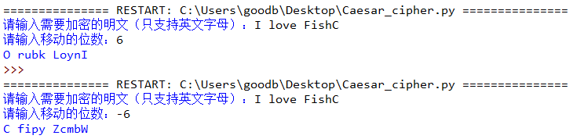
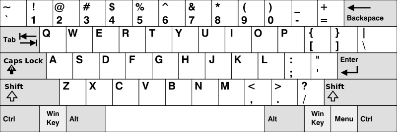

# 030-字符串04-截取_拆分和拼接

## 问答题

### 0. 请问下面三行代码的执行结果分别是什么？ 

- 代码

  

- 执行结果

  ```python
  # ilovefishc.com
  # www.ilovefish
  # ilovefish
  ```

### 1. 请问下面代码打印的内容是什么？

- 代码

  ```python
  >>> "www.ilovefishc.com".removeprefix("w.")
  ```

- 则返回一个原字符串的拷贝，因为该前缀不存在 。

### 2. `split()` 方法常常被应用于对数据的解析处理，那么考考大家，如果要从字符串 `"https://ilovefishc.com/html5/index.html"` 中提取出 "ilovefishc.com"，使用 split() 方法应该如何实现呢？

- 可以先试用`removeprefix()`删除 - https://前缀，随后使用split()方法指定`/`作为分隔符

- 代码实现

  > 这部分小甲鱼使用了很多个split()方法来分隔。
  
  ```python
  url = "https://ilovefishc.com/html5/index.html"
  remove_prefix = url.removeprefix("https://")
  result = remove_prefix.split('/')[0]  # 第一个元素就是目标字符串
  ```

### 3. 如果要求按换行符来分割字符串，小甲鱼推荐使用 `splitlines()` 方法，而非 split("\n")，你觉得小甲鱼的依据是什么？

- 这个教学视频中讲过了，因为在不同系统中换行符是不同的，因此使用`splitlines()`更为合适

### 4. 下面代码使用加号运算符（+）进行字符串拼接，现在看起来有点太 low 了，请将它改为使用 join() 方法来拼接吧~

- 代码

  ```python
  >>> s = "I" + " " + "love" + " " + "FishC"
  >>> s
  'I love FishC'
  ```

- 使用join() - 将列表拼接为字符串

  ```python
  ' '.join(['I', 'love', 'FishC'])
  ```

#### 5. 请问下面代码打印的内容是什么？

- 代码

  ```python
  >>> print(",\n".join("FishC"))
  ```

- 执行结果

  ```python
  F,
  i,
  s,
  h,
  C
  
  ```
  
  

---

## 动动手

### 0.  编写一个生成凯撒密码的程序

- 科普: 凯撒密码最早由古罗马军事统帅盖乌斯·尤利乌斯·凯撒在军队中用来传递加密信息，故称凯撒密码。(好像就是偏移来着)

- 原理

  ```python
  """
  凯撒密码是一种通过位移加密的方法，对 26 个（大小写）字母进行位移加密，比如下方是正向位移 6 位的字母对比表：
  明文字母表如下
  ABCDEFGHIJKLMNOPQRSTUVWXYZabcdefghijklmnopqrstuvwxyzN05W
  密文字母表如下
  GHIJKLMNOPQRSTUVWXYZABCDEFghijklmnopqrstuvwxyzabcdef5Agqd
  """
  ```

- 示例

  ```python
  如果给定加密的明文是：
  I love FishC
  
  那么程序加密后输出的密文便是
  O rubk LoynI
  ```

- 实现效果

  

- 代码实现

  ```python
  plain = list(input("请输入需要加密的明文（只支持英文字母）："))
  key = int(input("请输入移动的位数："))
      
  base_A = ord('A')
  base_a = ord('a')
      
  cipher = []
  for each in plain:
      if each == ' ':
          cipher.append(' ')
      else:
          if each.isupper():
              base = base_A
          else:
              base = base_a
          cipher.append(chr((ord(each) - base + key) % 26 + base))
      
  print(''.join(cipher))
  ```

### 1. 给定一个字符串数组 words，只返回可以使用在美式键盘同一行的字母打印出来的单词，键盘布局如下图所示。

- 键盘

  

- 美式键盘

  ```python
  """
  美式键盘中：
  
  第一行由字符 "qwertyuiop" 组成
  第二行由字符 "asdfghjkl" 组成
  第三行由字符 "zxcvbnm" 组成
  """
  ```

- 示例

  ```python
  输入：words = ["Twitter", "TOTO", "FishC", "Python", "ASL"]
  输出：['Twitter', 'TOTO', 'ASL']
  ```

  

- 代码实现

  ```python
  words = ["Twitter", "TOTO", "FishC", "Python", "ASL"]
  
  res = []
  for i in words:
      # 由于单词存在大小写，所以这里统一先转换为小写字母
      j = i.lower()
      # 灵活运用 strip() 方法，判断 j 是否所有字符都在键盘的同一行内
      if j.strip("qwertyuiop") == '' or j.strip("asdfghjkl") == '' or j.strip("zxcvbnm") == '':
          res.append(i)
  
  print(res)
  ```
  
  