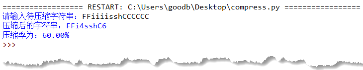

# 032-字符串06-格式化2与f字符串

## 问答题

### 0.  用 f-string，最需要注意的是什么？

- 支持的python版本，因为f-string是从3.6开始添加的语法糖。

### 1.请问下面代码会打印什么内容？

- 代码

  ```python
  f"{{1 + 2}}"
  ```

- 1 + 2

  > 我猜的-猜对了，英文外层的花括号会注释掉内侧的花括号，使其失去作用

### 2. 请问下面代码会打印什么内容？

- 代码

  ```python
  f"{{{1 + 2}}}"
  ```

- {3}

### 3.请将下面 format() 格式化字符串修改为 f-string 的格式？

- 代码

  ```python
  "{:.{prec}f}".format(3.1415, prec=2)
  ```

- f-string

  ```python
  prec = 2
  ty = 'f'
  f'{3.1415:.{prec}{ty}}'
  ```

- 小甲鱼

  ```python
  >>> f"{3.1415:.2f}"
  '3.14'
  ```

  

### 4. 请问下面代码会打印什么内容？

- 代码

  ```python
  >>> f"{520:.2}"
  ```

- 会报错吧，和.format方法一样
- 小甲鱼：因为整数不允许被设置“精度”选项，如果非要这么做，可以加一个 'f'（即 f"{520:.2f}"），表示将参数以小数的形式输出。

### 5. 请将下面 format() 格式化字符串修改为 f-string 的格式？

- 代码

  ```python
  >>> "{:{fill}{align}{width}.{prec}{ty}}".format(3.1415, fill='$', align='^', width=10, prec=2, ty='f')
  ```

- f-string

  ```python
  fill='$'
  align='^'
  width=10
  prec=2
  ty='f'
  
  f'{3.1415:{fill}{align}{width}.{prec}{ty}}'
  ```

- 小甲鱼

  ```python
  f"{3.1415:$^10.2f}"
  ```

  

## 动动手

### 0. 实现字符串的压缩和解压缩

- 说明

  ```python
  '''
  利用字符重复出现的次数，编写一个程序，实现基本的字符串压缩功能。比如，字符串 FFiiiisshCCCCCC 压缩后变成 F2i4s2h1C6（15字符 -> 10字符，66% 压缩率）。
  
  这种朴素的压缩算法并不总是理想的，比如 FFishCC 压缩后反而变长了 F2i1s1h1C2，这可就不是我们想要的了，所以对于重复次数小于 3 的字符，我们的程序应该选择不对其进行压缩
  
  '''
  ```

- 实现效果

  

  

-  代码实现

  > 有一点想法就是遍历字符串，如果字母连续出现次数小于3直接输出，而大于等于3则出现一次，并紧跟出现次数，最后计算压缩率

  ```python
  s = input("请输入待压缩字符串：")
  
  ch = s[0]
  result = ''
  count = 0
  
  for each in s:
      if each == ch:
          count += 1
      else:
          # 出现不一样的字符，将上一组的统计结果写入
          if count > 2:
              result += ch + str(count)
          if count == 2:
              result += ch + ch
          if count == 1:
              result += ch
          # 开启下一组的统计
          ch = each
          count = 1
  
  # 循环结束后，最后一组统计尚未写入，这里需要进行补写
  if count > 2:
      result += ch + str(count)
  elif count == 2:
      result += ch + ch
  else:
      result += ch
  
  print(f"压缩后的字符串：{result}")
  print(f"压缩率为：{len(result)/len(s)*100:.2f}%")
  ```

### 1. 请大家编写一个解压程序，将上一题压缩后的字符串进行解压缩

- 实现效果

  

- 代码实现

  > 看了看课后的小甲鱼解题过程，发现都不是那么容易

  ```python
  s = input("请输入待解压字符串：")
  
  s += ' '    # 小技巧：末尾添加一个空格
  ch = s[0]
  result = ''
  repeat = ''
  
  for each in s:
      if each.isdecimal():
          repeat += each
          continue
      else:
          if repeat != '':
              for i in range(int(repeat)-1):
                  result += ch
                  
          result += each 
          repeat = ''
          ch = each
  
  result.rstrip() # 去掉末尾的空格
  
  print(f"解压后的字符串：{result}")
  ```

  