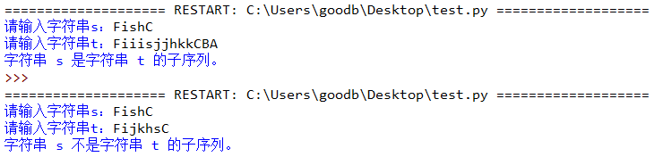

# 033-序列01

## 问答题

### 0.在 Python 中，每一个对象都有三个基本属性，你知道是什么吗？

- 唯一标识-id、类型-type和值-value

### 1.通过下面代码，是否可以证明字符串其实是属于可变序列？

- 代码

  ```python
  >>> x = "Fish"
  >>> x += "C"
  >>> print(x)
  FishC
  ```

- 不能，因为这是对x变量重新进行赋值,`id()`函数查看是不同的两个对象

### 2. 如果两个对象 a 和 b 的 id 值相同，那么 a is b 的运算结果就一定是 True，对吗？

- i~~d值相同，不一定其他属性相同。~~是（is）和不是（is not）被称之为同一性运算符，用于检测两个对象之间的 id 值是否相等。

### 3.  请使用切片的语法实现相同与下面代码的结果。

- 代码

  ```python
  >>> x = [1, 2, 3, 4, 5]
  >>> del x[1:4]
  >>> x
  [1, 5]
  ```

- 小甲鱼

  ```python
  >>> y = [1, 2, 3, 4, 5]
  >>> y[1:4] = []
  >>> y
  [1, 5]
  ```

### 4. 请使用 del 语句实现相同与下面代码的结果。

- 代码

  ```python
  >>> x = [1, 2, 3, 4, 5]
  >>> x.clear()
  ```

- del x[:]

  > 这个小甲鱼课堂上进行演示过。

---

## 动动手

### 0. 判断子序列

- 说明

  ```python
  """
  给定字符串 s 和 t ，请编程判断 s 是否为 t 的子序列
  
  字符串的子序列是原始字符串删除一些（也可以不删除）字符而不改变剩余字符相对位置形成的新字符串（例如，"ace" 是 "abcde" 的子序列，而 "aec" 则不是）
  """
  ```

- 实现效果

  

  

- 代码实现

  ```python
  s = input("请输入字符串s：")
  t = input("请输入字符串t：")
      
  n = len(s)
  m = len(t)
      
  j = k = 0
  while j < n and k < m:
      if s[j] == t[k]:
          j += 1
      k += 1
      
  if j == n:
      print("字符串 s 是字符串 t 的子序列。")
  else:
      print("字符串 s 不是字符串 t 的子序列。")
  ```

### 1. 给定一个字符串 s，请编程求出该字符串中的最大奇数

- 示例

  ```python
  输入：43383
  输出：43383
  
  输入：5926
  输出：59
  
  输入：966
  输出：9
  
  输入：64062
  输出：0
  ```

- 代码实现

  > 对字符串进行循环判断最大的数字是否是奇数

  ```python
  s = "43383"
      
  n = len(s)
  for j in range(n-1, -1, -1):
      if int(s[j]) % 2 == 1:
          # 找到第一个值为奇数的字符，返回 s[0:j+1]
          print(s[:j+1])
          break
  # 未找到值为奇数的字符，返回空字符串
  else:
      print(0)
  ```

  