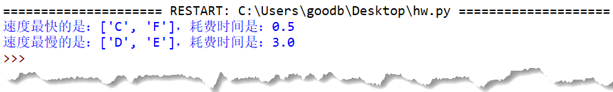

# 035-序列03-序列相关函数2与迭代器-可迭代对象

## 问答题

### 0. 请问下面代码会打印什么呢？

- 代码

  ```python
  >>> x = [1, 2, 5, 8, 0]
  >>> y = reversed(x)
  >>> for each in y:
  ...     print(each)
  ... 
  0
  8
  5
  2
  1
  >>> list(y)
  ```

- []，因为迭代器是一次性的，用完就没了。

### 1.请使用 [map()](https://fishc.com.cn/thread-191261-1-1.html) 函数，实现与下面代码相同的效果？

- 代码

  ```python
  >>> [ord(x) for x in "FishC"]
  [70, 105, 115, 104, 67]
  ```

- map()

  ```python
  list(map(ord, "FishC"))
  ```

### 2. 请使用 [map()](https://fishc.com.cn/thread-191261-1-1.html) 函数，对下面的二维列表进行排序？

- 代码

  ```python
  >>> matrix = [[1, 3, 2],
  ...            [5, 4, 6],
  ...            [8, 7, 9]]
  >>> # 这里利用好 map() 函数，一句代码的事情，就可以解决问题啦~
  >>> # 排序后的结果如下
  [[1, 2, 3], [4, 5, 6], [7, 8, 9]]
  ```

- map()

  ```python
  list(map(sorted, martix)
  ```

### 3.请问下面代码会打印什么呢？

- 代码

  ```python
  >>> seasons = ["Spring", "Summer", "Fall", "Winter"]
  >>> e = enumerate(seasons, start=11)
  >>> print(e[2])
  ```

- ~~输出结果: [13, "Fall"]~~;会报错，`enumerate()` 函数生成的是一个 **enumerate** 枚举对象，而非迭代器，所以不能使用下标对其进行随机访问。

### 4.请使用列表推导式，实现与下面代码相同的结果

- 代码

  ```python
  >>> list(filter(str.islower, "FishC"))
  ['i', 's', 'h']
  ```

- 列表推导式

  ```python
  [i for i in "FishC" if i.islower()]
  ```

### 5.下面代码试图同时对多个可迭代对象进行迭代操作，但是失败了……学了这一节课，你有没有办法解决这个问题？

- 代码

  ```python
  >>> x = [1, 2, 3, 4, 5]
  >>> y = "FishC"
  >>> for i, j in x, y:
  ...     print(i, j)
  ... 
  Traceback (most recent call last):
    File "<pyshell#26>", line 1, in <module>
      for i, j in x, y:
  ValueError: too many values to unpack (expected 2)
  ```

- 用enumerate函数或者zip函数吗？

- 小甲鱼

  ```python
  >>> for i, j in zip(x, y):
  ...     print(i, j)
  ... 
  1 F
  2 i
  3 s
  4 h
  5 C
  ```

  

### 6. 迭代器和可迭代对象最大的不同是？

- 迭代器一次性，可迭代对象可以多次重复使用。

### 7. 所有可迭代对象都可以转换成迭代器吗？

- ~~所有，是不是有点太绝对了，因此I guess 不能。~~是的，使用 [iter()](https://fishc.com.cn/thread-199497-1-1.html) 函数，就可以将一个可迭代对象转换成迭代器，然后使用 [next()](https://fishc.com.cn/thread-199499-1-1.html) 函数访问容器中的每一个元素（一次只能访问一个）。

---

## 动动手

### 0. 请使用学过的知识，自己动手编写代码，利用 for 循环语句，模拟 [all()](https://fishc.com.cn/thread-191253-1-1.html)、[any()](https://fishc.com.cn/thread-191254-1-1.html)、[enumerate()](https://fishc.com.cn/thread-191255-1-1.html)、[zip()](https://fishc.com.cn/thread-191256-1-1.html) 这4个函数的实现。

- 小甲鱼的demo - all()实现

  ```python
  >>> x = [1, 2, 0]
  >>> for each in x:
  ...     if not each:
  ...         print(False)
  ...         break
  ... else:
  ...     print(True)
  ... 
  False
  ```

- 代码实现

  ```python
  # enumrate()
  >>> seasons = ["Spring", "Summer", "Fall", "Winter"]
  >>> result = []
  >>> start = 0
  >>> for each in seasons:
  ...     result.append((start, each))
  ...     start += 1
  ... 
  >>> result
  [(0, 'Spring'), (1, 'Summer'), (2, 'Fall'), (3, 'Winter')]
  
  
  # zip()
  >>> x = [1, 2, 3]
  >>> y = "FishC"
  >>> if len(x) < len(y):
  ...     z = x
  ... else:
  ...     z = y
  ... 
  >>> result = []
  >>> for i in range(len(z)):
  ...     result.append((x[i], y[i]))
  ... 
  >>> result
  [(1, 'F'), (2, 'i'), (3, 's')]
  ```

### 1. 假设有一个密室，每次只能放一个人进去，在进去之前和出来之后都要求摁一下门口的打卡机按钮，打卡机会依次将名字和进出时间戳记录为以下的格式：

- 示例

  ```python
  times = [1, 3, 3.5, 6.5, 9.5, 10, 10.8]
  names = ["A", "B", "C", "D", "E", "F", "G"]
  ```

- 说明

  ```python
  """
  A 君是从时间戳为 0 的时候进入，从时间戳为 1 的时候出来，总共耗时为 1
  B 君是从时间戳为 1 的时候进入，从时间戳为 3 的时候出来，总共耗时为 2
  C 君是从时间戳为 3 的时候进入，从时间戳为 3.5 的时候出来，总共耗时为 0.5
  ...
  G 君是从时间戳为 10 的时候进入，从时间戳为 10.8 的时候出来，总共耗时为 0.8
  """
  ```

- 要求输出：统计给定的数据，打印耗时最长和最短的人员名称

- 实现效果

  

- 小甲鱼版本

  ```python
  times = [1, 3, 3.5, 6.5, 9.5, 10, 10.8]
  names = ["A", "B", "C", "D", "E", "F", "G"]
      
  max_name = [names[0]]
  min_name = [names[0]]
  max_time = times[0]
  min_time = times[0]
      
  for i in range(1, len(names)):
      each_name = names[i]
      each_time = times[i] - times[i-1]
      
      if each_time > max_time:
          max_name.clear()
          max_name.append(each_name)
          max_time = each_time
      elif each_time == max_time:
          max_name.append(each_name)
      elif each_time < min_time:
          min_name.clear()
          min_name.append(each_name)
          min_time = each_time
      elif each_time == min_time:
          min_name.append(each_name)
      
  print(f"速度最快的是：{min_name}，耗费时间是：{min_time}")
  print(f"速度最慢的是：{max_name}，耗费时间是：{max_time}")
  ```

  