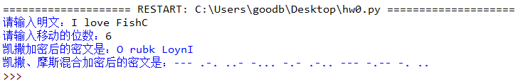
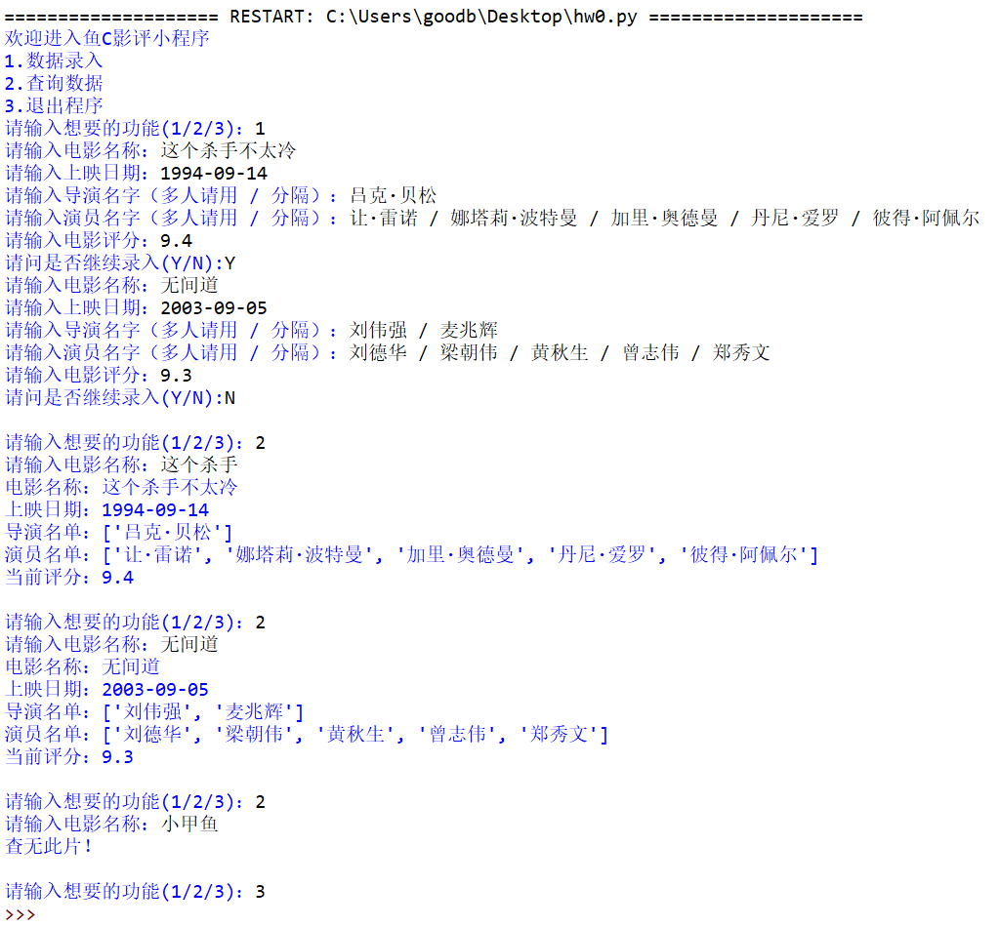

# 036-字典01

## 动动手

### 0.请改进课堂中的代码，实现双重加密（先执行凯撒加密，再执行莫斯加密）

- 示例说明

  ```python
  """
  举个例子，比如明文 I love FishC，执行凯撒加密（正向位移 6 位）后的结果是 O rubk LoynI，接着再执行莫斯加密，结果就是 --- .-. ..- -... -.- .-.. --- -.-- -. ..
  
  
  """
  ```

- 提示：凯撒加密的原理和实现请参考-> [传送门](https://fishc.com.cn/thread-185988-1-1.html)

- 程序实现

  

- 小甲鱼代码实现

  ```python
  plain = input("请输入明文：")
  key = int(input("请输入移动的位数："))
      
  # 下面进行凯撒加密
  cipher_caesar = []
      
  base_A = ord('A')
  base_a = ord('a')
      
  for each in plain:
      if each == ' ':
          cipher_caesar.append(' ')
      else:
          if each.isupper():
              base = base_A
          else:
              base = base_a
          cipher_caesar.append(chr((ord(each) - base + key) % 26 + base))
  print("凯撒加密后的密文是：", ''.join(cipher_caesar), sep='')
      
  # 下面进行摩斯加密
  # 摩斯密文表
  c_table = [".-", "-...", "-.-.", "-..", ".", "..-.",
             "--.", "....", "..", ".---", "-.-", ".-..",
             "--", "-.", "---", ".--.", "--.-", ".-.",
             "...", "-", "..-", "...-", ".--", "-..-",
             "-.--", "--..", ".----", "..---", "...--", "....-",
             ".....", "-....", "--...", "---..", "----.", "-----"]
      
  # 摩斯明文表
  d_table = ["A", "B", "C", "D", "E", "F",
             "G", "H", "I", "J", "K", "L",
             "M", "N", "O", "P", "Q", "R",
             "S", "T", "U", "V", "W", "X",
             "Y", "Z", "1", "2", "3", "4",
             "5", "6", "7", "8", "9", "0"]
      
  cipher_morse = []
  for each in cipher_caesar:
      each = each.upper()
      if each in d_table:
          cipher_morse.append(c_table[d_table.index(each)])
      
  print("凯撒、摩斯混合加密后的密文是：", ' '.join(cipher_morse), sep='')
  ```

### 1.请使用学过的知识，编写一个存储电影数据的小程序。

- 存放数据说明

  ```python
  电影名称
  上映时间
  导演（可能有多人）
  主演（通常有多人）
  电影评分
  ```

- 实现效果

  

- 代码实现

  ```python
  movies = []
  dates = []
  directors = []
  actors = []
  scores = []
      
  print("欢迎进入鱼C影评小程序")
  print("1.数据录入")
  print("2.查询数据")
  print("3.退出程序")
  op = int(input("请输入想要的功能(1/2/3)："))
      
  while op != 3:
      if op == 1:
          go = True
          while go:
              movies.append(input("请输入电影名称："))
              dates.append(input("请输入上映日期："))
              directors.append([i.strip() for i in input("请输入导演名字（多人请用 / 分隔）：").split('/')])
              actors.append([i.strip() for i in input("请输入演员名字（多人请用 / 分隔）：").split('/')])
              scores.append(input("请输入电影评分："))
      
              if 'N' == input("请问是否继续录入(Y/N):"):
                  go = False
      
      if op == 2:
          name = input("请输入电影名称：")
          for each in movies:
              if each.find(name) != -1:
                  print(f"电影名称：{each}")
                  print(f"上映日期：{dates[movies.index(each)]}")
                  print(f"导演名单：{directors[movies.index(each)]}")
                  print(f"演员名单：{actors[movies.index(each)]}")
                  print(f"当前评分：{scores[movies.index(each)]}")
                  break
          else:
              print("查无此片！")
      
      op = int(input("\n请输入想要的功能(1/2/3)："))
  ```

  