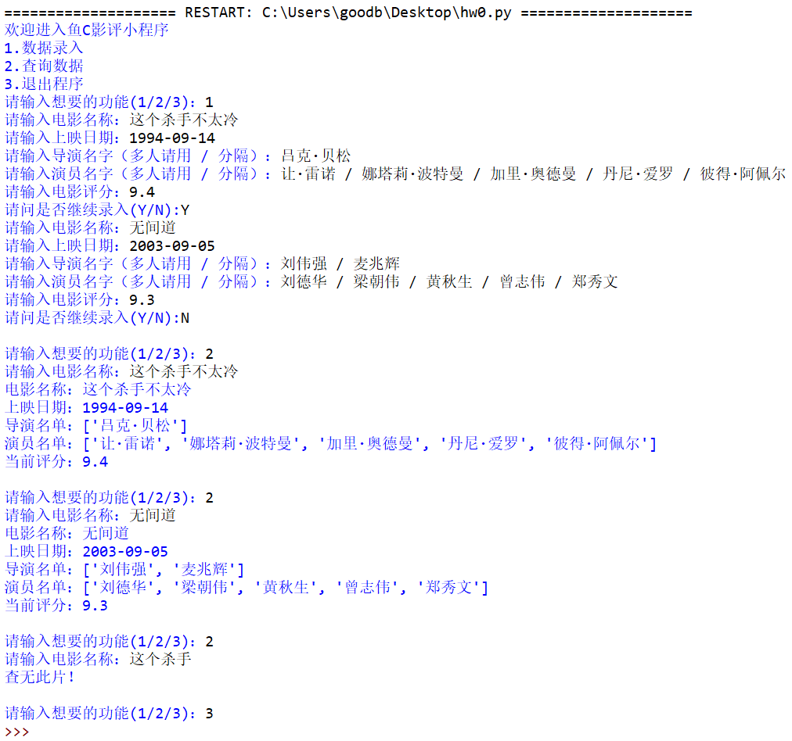
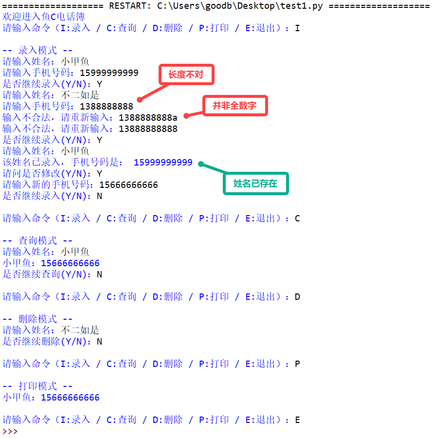

# 037-字典02

## 问答题

### 0.  请问下面变量 d 是一个字典吗？

- 代码

  ```python
  >>> d = {}
  ```

- ~~是一个集合 - set~~ 是一个空字典

### 1. 字典中，同样一个值是否可以出现两次？

- 可以，键只能唯一，但值可以多次出现

  > 补充，如果键多次出现，会出现后一个覆盖前一个的情况。

### 2. 请问下面代码创建的字典中，键和值分别是什么？

- 代码

  ```python
  >>> d = {}.fromkeys("吕布", 999)
  ```

- ~~key - 吕布~~

- ~~value - 999~~

- ```python
  >>> d
  {'吕': 999, '布': 999}
  ```

### 3.  请问下面代码中，del d 这个语句，是单独删除 d 变量还是将 d 变量和其指定的字典一起干掉呢？

- 代码

  ```python
  d = dict.fromkeys("Fish", 250)
  del d
  ```

- 一起删除

### 4. 请问下面创建字典的 8 种方法中，哪几种是正确的。

- 代码

  ```python
  >>> a = {99:"吕布", 90:"关羽", 60:"刘备"}
  >>> b = dict(99:"吕布", 90:"关羽", 60:"刘备")
  >>> c = dict(99="吕布", 90="关羽", 60="刘备")
  >>> d = dict([(99, "吕布"), (90, "关羽"), (60, "刘备")])
  >>> e = dict({99:"吕布", 90:"关羽", 60:"刘备"})
  >>> f = dict({99="吕布", 90="关羽", 60="刘备"})
  >>> h = dict({99:"吕布", 90:"关羽"}, 60="刘备")
  >>> i = dict(zip([99, 90, 60], ["吕布","关羽","刘备"]))
  ```

- a、d、e、i

### 5.请问下面代码执行之后，变量 b 中的内容是？

- 代码

  ```python
  >>> a = {"小甲鱼":"You are my super star."}
  >>> b = a
  >>> a.clear()
  ```

- 这个和列表中相似，会清空原字典

---

## 动动手

### 0. 请利用字典类型，改进上一节课后作业的电影查询小程序

- 存放数据说明

  ```python
  电影名称
  上映时间
  导演（可能多人）
  主演（可能多人）
  电影评分
  ```

- 实现效果

  

- 代码实现 - 小甲鱼

  ```python
  movies = {}
      
  print("欢迎进入鱼C影评小程序")
  print("1.数据录入")
  print("2.查询数据")
  print("3.退出程序")
  op = int(input("请输入想要的功能(1/2/3)："))
      
  while op != 3:
      if op == 1:
          go = True
          while go:
              movie = input("请输入电影名称：")
              date = input("请输入上映日期：")
              directors = [i.strip() for i in input("请输入导演名字（多人请用 / 分隔）：").split('/')]
              actors = [i.strip() for i in input("请输入演员名字（多人请用 / 分隔）：").split('/')]
              scores = input("请输入电影评分：")
              movies[movie] = [date, directors, actors, scores]
      
              if 'N' == input("请问是否继续录入(Y/N):"):
                  go = False
      
      if op == 2:
          name = input("请输入电影名称：")
          if name in movies:
              print(f"电影名称：{name}")
              print(f"上映日期：{movies[name][0]}")
              print(f"导演名单：{movies[name][1]}")
              print(f"演员名单：{movies[name][2]}")
              print(f"当前评分：{movies[name][3]}")
          else:
              print("查无此片！")
      
      op = int(input("\n请输入想要的功能(1/2/3)："))
  ```

### 1. 请编写一个电话簿程序

- 实现效果

  

- 代码实现

  ```python
  phone_book = {}
      
  print("欢迎进入鱼C电话簿")
  while True:
      ins = input("请输入命令（I:录入 / C:查询 / D:删除 / P:打印 / E:退出）：")
      
      if ins == 'I':
          print("\n-- 录入模式 --")
          while True:
              name = input("请输入姓名：")
              if name in phone_book:
                  print("该姓名已录入，手机号码是：", phone_book[name])
                  if input("请问是否修改(Y/N)：") == 'Y':
                      phone = input("请输入新的手机号码：")
                      while not phone.isnumeric() or len(phone) != 11:
                          phone = input("输入不合法，请重新输入：")
                  else:
                      phone = phone_book[name]
              else:
                  phone = input("请输入手机号码：")
                  while not phone.isnumeric() or len(phone) != 11:
                      phone = input("输入不合法，请重新输入：")
              phone_book[name] = phone
              if input("是否继续录入(Y/N)：") != 'Y':
                  print()
                  break
      
      elif ins == 'C':
          print("\n-- 查询模式 --")
          while True:
              name = input("请输入姓名：")
              if name in phone_book:
                  print(name, phone_book[name], sep="：")
              if input("是否继续查询(Y/N)：") != 'Y':
                  print()
                  break
      
      elif ins == 'D':
          print("\n-- 删除模式 --")
          while True:
              name = input("请输入姓名：")
              if name in phone_book:
                  phone_book.pop(name)
              if input("是否继续删除(Y/N)：") != 'Y':
                  print()
                  break
      
      elif ins == 'P':
          print("\n-- 打印模式 --")
          for each in phone_book:
              print(each, phone_book[each], sep="：")
          print()
      
      elif ins == 'E':
          break
  ```

  