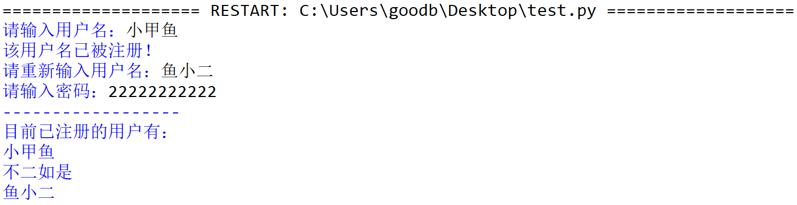
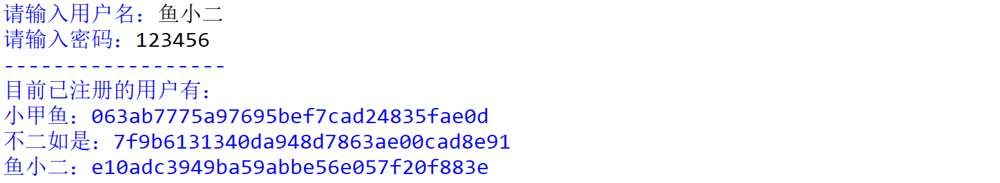

# 038-字典03

## 问答题

### 0. **请问可以使用下面方法来更新字典的值吗？**

- 代码

  ```python
  >>> d = dict.fromkeys("FishC")
  >>> d.update([('F',70), ('i',105), ('s',115), ('h',104), ('C',67)])
  ```

- 可以 - 多个键值对、传入字典、包括键值对的可迭代对象

  ```python
  >>> d.update(F=70, i=105, s=115, h=104, C=67)
  >>> d.update({'F':70, 'i':105, 's':115, 'h':104, 'C':67})
  >>> d.update([('F',70), ('i',105), ('s',115), ('h',104), ('C',67)])
  ```

### 1. **请问下面代码执行之后，变量 e 的内容是？**

- 代码 

  ```python
  >>> d = {"小甲鱼":"千年王八，万年龟。"}
  >>> e = d.copy()
  >>> d["小甲鱼"] = "666"
  ```

- 与列表相同，修改时浅拷贝一层不会影响，但是更深的层级会影响。

### 2. **请问下面代码执行之后，变量 e 的内容是？**

- 代码

  ```python
  >>> d = {"小甲鱼":{"数学":99, "英语":88, "语文":101}}
  >>> e = d.copy()
  >>> d["小甲鱼"]["语文"] = 100
  ```

- 这个就会发生改变了，会影响到内层的嵌套字典，`{'小甲鱼': {'数学': 99, '英语': 88, '语文': 100}}`

### 3. **请问下面代码执行之后，字典 d 的内容是？**

- 代码

  ```python
  >>> d = {}
  >>> d[1] = "千年王八"
  >>> d[1.0] = "万年龟"
  ```

- 靠，这个真是不知道的特性，字典是基于散列表实现的，由于 “键的值如果相等，哈希值就必须一致” 的原理，所以 1.0 和 1 在字典中认为是同一个键，对同一个键进行重复赋值，Python 会用新的值去覆盖旧的值。

### 4. **`items()、keys()、values()` 三个方法分别用于获取字典的键值对、键和值三者的视图对象，你如何理解 “视图对象“ 的含义？**

- 对应关系吧。
- 小甲鱼解释：所谓视图对象，就是提供观察字典的窗口，字典内容一变，它们会动态地跟着修改，类似于动态修改，随后其内容也会得到修改后的呈现。

### 5.**请问如何判断某一个值是否在字典中？**

- 使用`in`来判断。

- 小甲鱼给出了示例：

  ```python
  >>> d = {'F':70, 'i':105, 's':115, 'h':104, 'C':67}
  >>> 115 in d.values()  # 类似于判断列表中的元素。
  True
  ```

### 6.**请问视频最后演示的代码，为什么字典 d 打印出来的结果是酱紫的？**

- 代码

  ```python
  >>> d = {x:y for x in [1, 3, 5] for y in [2, 4, 6]}
  >>> d
  {1: 6, 3: 6, 5: 6}
  ```

- 这就是字典推导式的应用，但又因为字典中的键是唯一的，所以每次都会覆盖，只保留6这一个值。

- 小甲鱼解析

  ```python
  >>> for x in [1, 3, 5]:
  ...     for y in [2, 4, 6]:
  ...         print(f"d[{x}] = {y}")
  ...         d[x] = y
  ... 
  # 会发现前两个键是相同的，因此会不断覆盖。
  d[1] = 2
  d[1] = 4
  d[1] = 6
  d[3] = 2
  d[3] = 4
  d[3] = 6
  d[5] = 2
  d[5] = 4
  d[5] = 6
  >>> d
  {1: 6, 3: 6, 5: 6}
  ```

---

## 动动手

### 0.**请按照要求编写一个网站的注册模块**版权

- 要求

  ```python
  用户名不允许重复
  数据库需要保存用户名及密码
  初始用户及密码（"小甲鱼":"I_love_FishC"，"不二如是":"FishC5201314"）
  ```

- 实现效果
  

- 代码实现

  ```python
  fc_db = {"小甲鱼":"I_love_FishC", "不二如是":"FishC5201314"}
      
  name = input("请输入用户名：")
  while True:
      if fc_db.get(name) != None:
          print("该用户名已被注册！")
          name = input("请重新输入用户名：")
      else:
          break
      
  passwd = input("请输入密码：")
  fc_db[name] = passwd
  
  print("------------------")
  print("目前已注册的用户有：")
  for each in fc_db:
      print(each)
  ```

### 1.提升网站的安全性  - 算法加密

- 加密实例 - MD5

  ```python
  >>> import hashlib
  >>> result = hashlib.md5(b"FishC")
  >>> print(result.hexdigest())
  9d22182e926ca703cd0f5926e7d57782
  ```

- 提示

  ```python
  hashlib.md5() 的参数是需要一个 b 字符串（即 bytes 类型的对象），这里可以使用 bytes("123", "utf-8") 的方式将 "123" 转换为 b"123"。
  
  好了，那么请大家将上一题代码中的明文密码，使用 MD5 进行加密吧
  ```

- 实现效果

  

- 代码实现

  ```python
  import hashlib
      
  fc_db = {"小甲鱼":hashlib.md5(b"I_love_FishC"), "不二如是":hashlib.md5(b"FishC5201314")}
      
  name = input("请输入用户名：")
  while True:
      if fc_db.get(name) != None:
          print("该用户名已被注册！")
          name = input("请重新输入用户名：")
      else:
          break
      
  passwd = input("请输入密码：")
  bstr = bytes(passwd, "utf-8")
  passwd = hashlib.md5(bstr)
  fc_db[name] = passwd
      
  print("------------------")
  print("目前已注册的用户有：")
  for each in fc_db.items():
      print(each[0], each[1].hexdigest(), sep="：")
  ```

  